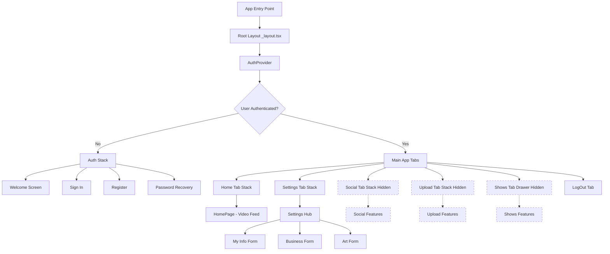
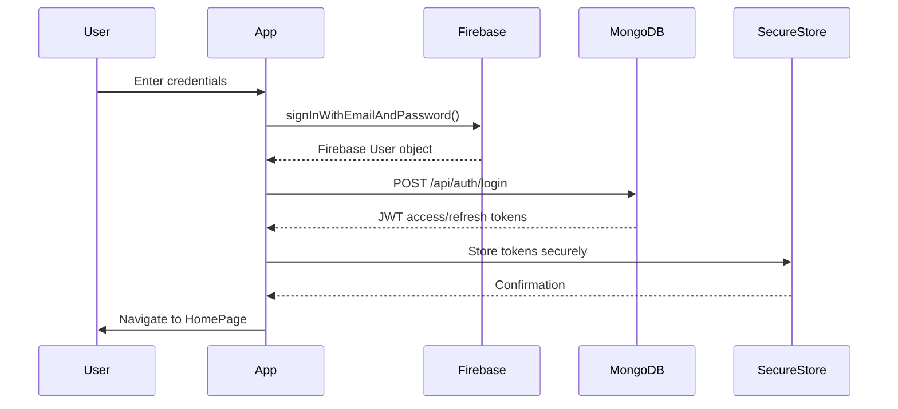
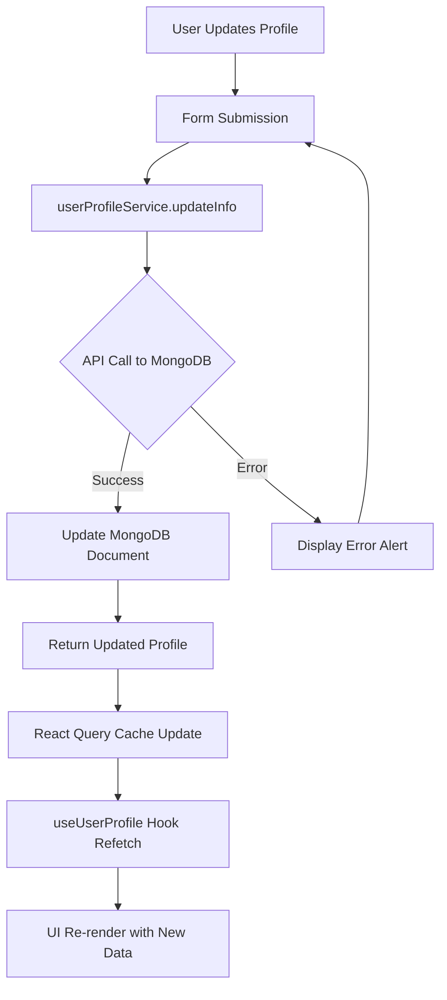
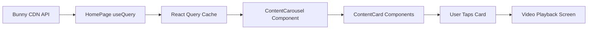

# MillennialsPrimeAPP - Application Overview

## Executive Summary

MillennialsPrimeAPP is a React Native mobile application built with Expo, targeting Millennials (born 1981-1997) with premium video content, social networking, and e-commerce features. The app features a dual authentication system (Firebase + MongoDB), file-based routing with Expo Router, and a modular architecture with both active and hidden features ready for progressive release.

## Tech Stack

### Frontend Framework
- **React Native 19.0.0**: Cross-platform mobile framework
- **Expo SDK ~52.0.14**: Development platform and tools
- **TypeScript**: Type-safe JavaScript for better code quality

### Navigation & Routing
- **Expo Router ~5.1.7**: File-based routing system
- **React Navigation 19.0.0**: Navigation library (Stack, Tabs, Drawer)
  - `@react-navigation/native-stack`: Stack navigation
  - `@react-navigation/bottom-tabs`: Tab navigation
  - `@react-navigation/drawer`: Drawer navigation

### Authentication & Database
- **Firebase (React Native Firebase ~21.8.1)**:
  - Firebase Authentication for client-side auth
  - Firebase App for core functionality
- **MongoDB**: Server-side database for user profiles and content
- **JWT Tokens**: Stored securely in `expo-secure-store`

### State Management & Data Fetching
- **React Query (@tanstack/react-query ~5.64.2)**: Server state management
- **React Context API**: Global auth state
- **Local State (useState)**: Component-level state

### UI & Styling
- **React Native Paper ~5.12.6**: Material Design components
- **Expo Linear Gradient ~14.0.1**: Gradient backgrounds
- **React Native Gesture Handler ~2.20.2**: Touch interactions
- **React Native Reanimated ~3.16.5**: Smooth animations
- **Styled Components**: Component styling patterns
- **Custom Color Schemes**: Dark/light mode support

### Media & Content
- **Bunny CDN**: Video content delivery and streaming
- **Expo Image Picker ~16.0.4**: Profile picture and content uploads
- **React Native WebView ~13.12.4**: Streaming video playback

### Developer Tools
- **ESLint**: Code linting
- **Prettier**: Code formatting
- **Jest ~29.7.0**: Unit testing
- **React Test Library**: Component testing

## Application Architecture

### Overall Structure



### Dual Authentication System



**Authentication Flow:**
1. **Firebase Authentication** (Primary): Handles user credentials, password reset, session persistence
2. **MongoDB Authentication** (Secondary): Provides API access tokens for server-side operations
3. **Token Storage**: JWT tokens stored in `expo-secure-store` (iOS Keychain/Android Keystore)
4. **Auth State Management**: AuthProvider subscribes to Firebase auth state changes and updates global context

### File-Based Routing Architecture

**Expo Router Convention:**
- Directories in parentheses `(groupName)` create route groups without affecting URL
- `_layout.tsx` files define navigator wrappers for their directory
- `index.tsx` serves as the default route for a directory
- `[param].tsx` creates dynamic routes (e.g., `[id].tsx` → `/user/123`)

**Route Structure:**
```
app/
├── _layout.tsx                 # Root Stack Navigator + Auth Gating
├── index.tsx                   # Welcome/Splash Screen
├── (auth)/_layout.tsx          # Auth Stack Navigator
│   ├── SignInScreen.tsx        # /(auth)/SignInScreen
│   ├── RegisterScreen.tsx      # /(auth)/RegisterScreen
│   └── PasswordRecoveryScreen.tsx
├── (tabs)/_layout.tsx          # Tabs Navigator
│   ├── (home)/_layout.tsx      # Home Stack Navigator
│   │   └── HomePage.tsx        # /(tabs)/(home)/HomePage
│   ├── (settings)/_layout.tsx  # Settings Stack Navigator
│   │   ├── Settings.tsx
│   │   ├── MyInfoScreen.tsx
│   │   ├── BusinessScreen.tsx
│   │   └── ArtScreen.tsx
│   ├── (social)/_layout.tsx    # Social Drawer Navigator (hidden)
│   │   ├── index.tsx
│   │   ├── [id].tsx            # Dynamic user profile
│   │   └── ...
│   └── LogOutScreen.tsx
└── (aux)/
    └── disclaimer.tsx
```

## Data Flow Architecture

### User Profile Data Flow



### Video Content Data Flow



## Component Architecture

### Component Hierarchy

**Reusable Components** (`/components/`):
- **ContentCard**: Individual content item card with gradient background
- **ContentCarousel**: Horizontal scrollable carousel for content
- **ProfilePicture**: Profile image display and upload
- **ThemedText, ThemedView**: Theme-aware components
- **ErrorBoundary**: Error handling wrapper
- **TabBarIcon**: Tab navigation icons

**Shared Components** (`/shared/`):
- **PostComponents**: PrimeNewsPost, TextPost, PicturePost, VideoPost
- **User Components**: User, ConnectedUserInfo
- **Modals**: CustomBottomSheet, CommentModal
- **Upload**: UploadBox for file uploads
- **Timer**: HMSTimer, DHMSTimer countdown components

### Design Patterns

**1. Provider Pattern**
- `AuthProvider` wraps entire app
- `QueryClientProvider` for React Query
- `BottomSheetModalProvider` for modals

**2. Custom Hooks**
- `useAuth()`: Access authentication state
- `useUserProfile()`: Fetch and cache user profile
- `useAxiosPrivate()`: Authenticated API requests
- `useColorScheme()`: Dark/light mode detection

**3. Pure Functional Components**
- ContentCard implements pure component pattern
- Props-driven rendering
- No side effects in render
- Helper functions for derived state

**4. Form Management**
- Local state for form inputs
- Real-time validation on blur
- Conditional rendering based on answers
- Sequential multi-step forms (Settings workflow)

## Key Architectural Decisions

### 1. Dual Authentication System

**Rationale**: Separation of concerns
- **Firebase**: Handles user credentials, security, session management
- **MongoDB**: Provides flexible user profile storage and API access control
- **Benefit**: Firebase provides battle-tested auth security, MongoDB provides custom profile schema flexibility

**Trade-off**: Added complexity with two auth systems, but improved security and flexibility

### 2. File-Based Routing (Expo Router)

**Rationale**: Convention over configuration
- **Benefit**: File structure directly maps to routes, reducing boilerplate
- **Benefit**: Type-safe navigation with TypeScript
- **Benefit**: Automatic deep linking support

**Trade-off**: Less explicit than manual route configuration, learning curve for new pattern

### 3. Feature Toggles via `href: null`

**Rationale**: Progressive feature release
- Social, Upload, and Shows features are fully implemented but hidden
- Can be enabled by removing `href: null` in tab configuration
- Allows development ahead of launch without exposing incomplete features

**Benefit**: Faster iteration, safer releases, modular feature rollout

### 4. Component-Based Architecture

**Rationale**: Reusability and maintainability
- Atomic components (ContentCard, User, ProfilePicture)
- Composite screens built from smaller components
- Shared styles and theming

**Benefit**: Consistent UI, easier testing, reduced code duplication

## Security Considerations

### Authentication Security
- Firebase handles password hashing and secure transmission
- JWT tokens stored in platform-specific secure storage (Keychain/Keystore)
- Tokens never stored in AsyncStorage or local state
- Automatic token refresh mechanism

### Data Security
- User-generated content validated on client and server
- Profile data only accessible by authenticated users
- API endpoints protected with JWT middleware
- MongoDB document-level permissions

### Input Validation
- Email format validation (regex)
- Password strength requirements
- Date of birth validation (Millennials 1981-1997)
- Form field sanitization before submission

## Performance Optimizations

### React Query Caching
- User profile data cached with 5-minute stale time
- Background refetching for fresh data
- Optimistic updates for form submissions
- Reduces unnecessary API calls

### Content Delivery
- Bunny CDN for video streaming (low latency, high bandwidth)
- Image optimization with Expo Image
- Lazy loading for off-screen content

### Navigation Performance
- Stack navigation preserves screen state
- Tab navigation keeps all tabs mounted for instant switching
- Minimal re-renders with pure components

## Testing Strategy

### Unit Testing (Jest)
- Form validation logic
- Helper functions (date formatting, validation)
- Component rendering with React Testing Library

### Integration Testing
- Authentication flows
- Form submissions
- Navigation flows

### Manual Testing
- Device testing (iOS/Android)
- Dark/light mode testing
- Network error scenarios
- Offline behavior

## Development Workflow

### Environment Setup
1. Clone repository
2. `npm install` to install dependencies
3. Configure Firebase credentials (GoogleService-Info.plist, google-services.json)
4. Set up `.env` file with MongoDB API endpoints
5. `npx expo start` to run dev server

### Build & Deploy
- **Development**: `expo start` with Expo Go
- **Preview**: `expo build:ios` / `expo build:android`
- **Production**: EAS Build for app store submission

## Future Enhancements

### Planned Features (Currently Hidden)
1. **Social Tab**: User connections, profiles, social feed, e-commerce
2. **Upload Tab**: User-generated content uploads
3. **Shows Tab**: Premium show streaming with drawer navigation

### Roadmap Considerations
- Push notifications for new content
- Offline content caching
- Advanced video analytics
- Payment integration for premium features
- Admin panel for content management

## Configuration Files Reference

**Key Configuration Files:**
- [app.json](../../app.json) - Expo app configuration
- [package.json](../../package.json) - Dependencies and scripts
- [tsconfig.json](../../tsconfig.json) - TypeScript configuration
- [firebase/firebaseConfig.ts](../../firebase/firebaseConfig.ts) - Firebase initialization
- [constants/Colors.ts](../../constants/Colors.ts) - Theme color definitions
- [constants/global.ts](../../constants/global.ts) - Global styles

## Project Statistics

- **Total Screens**: 21 screens
- **Active Screens**: 10 screens (Auth: 4, Home: 1, Settings: 4, LogOut: 1)
- **Hidden Screens**: 7 screens (Social: 5, Upload: 1, Shows: 2)
- **Reusable Components**: ~26 components
- **Shared Components**: ~11 component groups
- **Lines of Code**: Extensive TypeScript codebase with proper error handling and testing

## Documentation Index

- [Navigation Structure](./NAVIGATION_STRUCTURE.md) - Detailed navigation hierarchy and flows
- [Feature Status](./FEATURE_STATUS.md) - Active vs hidden features and how to enable them
- [Wireframes](../wireframes/README.md) - Screen-by-screen wireframes with Mermaid diagrams
- [User Journeys](../user-journeys/README.md) - High-level user flow diagrams
- [Component Library](../components/COMPONENT_LIBRARY.md) - Reusable component documentation

## Contacts & Resources

**Repository**: MillennialsPrimeAPP (Local)
**Platform**: React Native (Expo)
**License**: Proprietary - JustAPPin' LLC

---

*Last Updated: 2026-01-30*
*This document is maintained as part of the app documentation suite and should be updated when architectural changes occur.*
