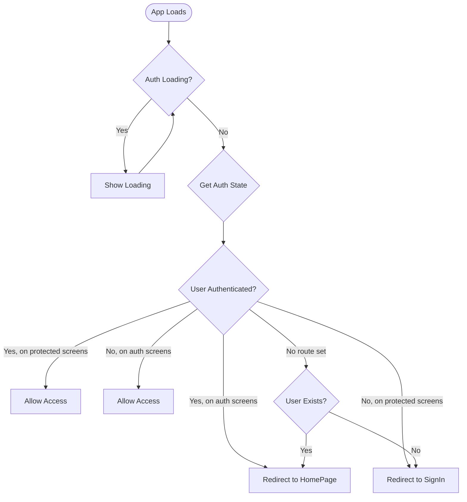
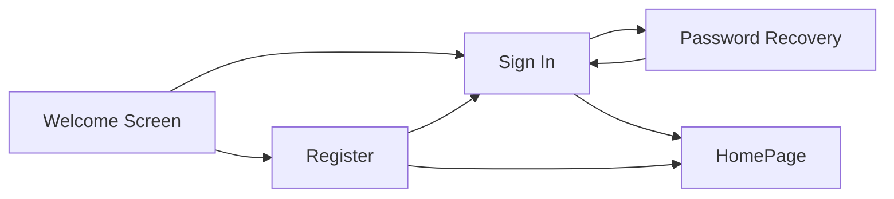
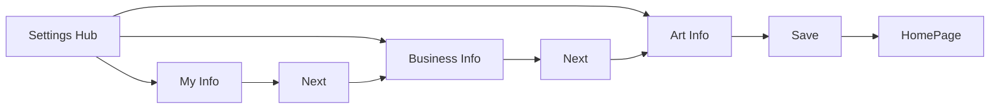
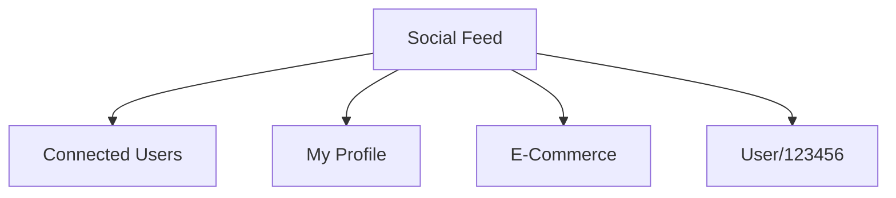

# Navigation Structure

## Overview

MillennialsPrimeAPP uses **Expo Router** (v5.1.7) for file-based routing, combined with React Navigation primitives (Stack, Tabs, Drawer) to create a hierarchical navigation structure. The app implements authentication-based routing at the root level, directing users to different navigation stacks based on their login state.

## Navigation Framework

### Core Libraries
- **expo-router ~5.1.7**: File-based routing system
- **@react-navigation/native-stack**: Stack navigation
- **@react-navigation/bottom-tabs**: Tab navigation
- **@react-navigation/drawer**: Drawer navigation

### Navigator Types Used

| Navigator Type | Purpose | Location |
|----------------|---------|----------|
| **Stack** | Screen-to-screen transitions with back stack | Root, Auth, Tab groups |
| **Tabs** | Bottom tab bar for main app sections | Main app container |
| **Drawer** | Side menu navigation | Shows tab (hidden) |

## File-Based Routing Conventions

### Expo Router Patterns

**1. Route Groups** - `(groupName)/`
- Creates logical groups without affecting URLs
- Example: `(auth)/` and `(tabs)/` both route from root

**2. Layout Files** - `_layout.tsx`
- Define navigator wrappers for their directory
- Configure screen options and navigation structure

**3. Index Routes** - `index.tsx`
- Default route for a directory
- Example: `app/index.tsx` → `/` (root)

**4. Dynamic Routes** - `[param].tsx`
- Parameterized routes for dynamic content
- Example: `[id].tsx` → `/user/123`

**5. Screen Files** - `ScreenName.tsx`
- Individual screen components
- Auto-registered with parent navigator

## Navigation Hierarchy

### Complete Navigation Tree

```mermaid
graph TD
    Root[Root Layout _layout.tsx<br/>Stack Navigator] --> Auth{Auth State?}

    Auth -->|Not Authenticated| AuthGroup[Auth Group<br/>_layout.tsx Stack]
    Auth -->|Authenticated| TabsGroup[Tabs Group<br/>_layout.tsx Tabs]

    AuthGroup --> A1[index.tsx<br/>Welcome Screen]
    AuthGroup --> A2[SignInScreen.tsx]
    AuthGroup --> A3[RegisterScreen.tsx]
    AuthGroup --> A4[PasswordRecoveryScreen.tsx]
    AuthGroup --> A5[AboutScreen.tsx]

    TabsGroup --> T1[Home Tab<br/>_layout.tsx Stack]
    TabsGroup --> T2[Settings Tab<br/>_layout.tsx Stack]
    TabsGroup --> T3[Social Tab HIDDEN<br/>_layout.tsx Drawer]
    TabsGroup --> T4[Upload Tab HIDDEN<br/>_layout.tsx Stack]
    TabsGroup --> T5[Shows Tab HIDDEN<br/>_layout.tsx Drawer]
    TabsGroup --> T6[LogOut Tab<br/>Direct Screen]

    T1 --> H1[HomePage.tsx]

    T2 --> S1[Settings.tsx]
    T2 --> S2[MyInfoScreen.tsx]
    T2 --> S3[BusinessScreen.tsx]
    T2 --> S4[ArtScreen.tsx]

    T3 -.-> SO1[index.tsx<br/>Social Feed]
    T3 -.-> SO2[ConnectedUsersScreen.tsx]
    T3 -.-> SO3[MyProfileScreen.tsx]
    T3 -.-> SO4[EComm.tsx]
    T3 -.-> SO5[id.tsx<br/>User Profile]

    T4 -.-> U1[UploadContentScreen.tsx]

    T5 -.-> SH1[PrimeShow.tsx<br/>Drawer Item]
    T5 -.-> SH2[ShowViewScreen.tsx<br/>Stack Screen]

    style T3 stroke-dasharray: 5 5
    style T4 stroke-dasharray: 5 5
    style T5 stroke-dasharray: 5 5
    style SO1 stroke-dasharray: 5 5
    style SO2 stroke-dasharray: 5 5
    style SO3 stroke-dasharray: 5 5
    style SO4 stroke-dasharray: 5 5
    style SO5 stroke-dasharray: 5 5
    style U1 stroke-dasharray: 5 5
    style SH1 stroke-dasharray: 5 5
    style SH2 stroke-dasharray: 5 5
```



## Authentication-Based Routing

### Root Layout Auth Gating

**File**: [app/_layout.tsx](../../app/_layout.tsx)

The root layout implements authentication-based routing logic:

```typescript
// Pseudo-code representation
function RootLayoutNav() {
  const { user, loading } = useAuth();
  const segments = useSegments();
  const router = useRouter();

  useEffect(() => {
    if (loading) return; // Wait for auth state to load

    const inAuthGroup = segments[0] === "(auth)";

    if (user && inAuthGroup) {
      // Authenticated user on auth screens → redirect to home
      router.replace("/(tabs)/(home)/HomePage");
    } else if (!user && !inAuthGroup && segments[0] !== undefined) {
      // Unauthenticated user on protected routes → redirect to sign in
      router.replace("/(auth)/SignInScreen");
    } else if (segments[0] === undefined) {
      // No route set → redirect based on auth state
      router.replace(user ? "/(tabs)/(home)/HomePage" : "/(auth)/SignInScreen");
    }
  }, [user, segments, loading]);

  return <Stack>...</Stack>;
}
```

**Auth Gating Flow:**



## Navigation Groups

### 1. Authentication Group `(auth)/`

**File**: [app/(auth)/_layout.tsx](../../app/(auth)/_layout.tsx)

**Navigator**: Stack
**Access**: Unauthenticated users only (auto-redirected if logged in)

**Screens**:
- `index.tsx` - Welcome/splash screen
- `SignInScreen.tsx` - Email/password login
- `RegisterScreen.tsx` - New user registration
- `PasswordRecoveryScreen.tsx` - Password reset
- `AboutScreen.tsx` - About page

**Stack Configuration**:
- `headerShown: false` - Custom headers in screens
- Modal presentation for some screens
- Replace navigation to prevent back button to auth

### 2. Main App Tabs `(tabs)/`

**File**: [app/(tabs)/_layout.tsx](../../app/(tabs)/_layout.tsx)

**Navigator**: Tabs (Bottom Tab Bar)
**Access**: Authenticated users only

**Tab Configuration**:
```typescript
{
  tabBarStyle: {
    height: 80,
    borderTopLeftRadius: 20,
    borderTopRightRadius: 20,
  },
  tabBarActiveTintColor: colors.priC,
  tabBarInactiveTintColor: colors.secC,
}
```

**Visible Tabs** (3):
1. **Home Tab** - Main content feed
2. **Settings Tab** - User profile and settings
3. **LogOut Tab** - Logout action

**Hidden Tabs** (3) - `href: null`:
4. **Social Tab** - Social networking features
5. **Upload Tab** - Content upload
6. **Shows Tab** - Premium show streaming

### 3. Home Tab `(tabs)/(home)/`

**File**: [app/(tabs)/(home)/_layout.tsx](../../app/(tabs)/(home)/_layout.tsx)

**Navigator**: Stack
**Status**: Active

**Screens**:
- `HomePage.tsx` - Main content feed with video carousels

**Features**:
- Featured video hero section
- Multiple content carousels (New Episodes, Popular, Recommended)
- Bunny CDN video integration
- Loading and error states

### 4. Settings Tab `(tabs)/(settings)/`

**File**: [app/(tabs)/(settings)/_layout.tsx](../../app/(tabs)/(settings)/_layout.tsx)

**Navigator**: Stack
**Status**: Active

**Screens**:
1. `Settings.tsx` - Settings hub with profile picture
2. `MyInfoScreen.tsx` - Personal information form
3. `BusinessScreen.tsx` - Business questionnaire
4. `ArtScreen.tsx` - Artist questionnaire

**Navigation Flow**:
```
Settings Hub
    → Personal Info → Next
    → Business Info → Next
    → Art Info → Save → HomePage
```

### 5. Social Tab `(tabs)/(social)/` [HIDDEN]

**File**: [app/(tabs)/(social)/_layout.tsx](../../app/(tabs)/(social)/_layout.tsx)

**Navigator**: Drawer + Stack (hybrid)
**Status**: Hidden (`href: null`)

**Screens**:
- `index.tsx` - Social feed with navigation buttons
- `ConnectedUsersScreen.tsx` - Connected users list
- `MyProfileScreen.tsx` - User profile with posts
- `EComm.tsx` - E-commerce marketplace
- `[id].tsx` - Dynamic user profile route

**Drawer Configuration**:
- PrimeShow listed as drawer menu item
- Stack screens for other routes

### 6. Upload Tab `(tabs)/(upload)/` [HIDDEN]

**File**: [app/(tabs)/(upload)/_layout.tsx](../../app/(tabs)/(upload)/_layout.tsx)

**Navigator**: Stack
**Status**: Hidden (`href: null`)

**Screens**:
- `UploadContentScreen.tsx` - File upload interface with UploadBox component

### 7. Shows Tab `(tabs)/(shows)/` [HIDDEN]

**File**: [app/(tabs)/(shows)/_layout.tsx](../../app/(tabs)/(shows)/_layout.tsx)

**Navigator**: Drawer + Stack (hybrid)
**Status**: Hidden (`href: null`)

**Screens**:
- `PrimeShow.tsx` - WebView streaming (Drawer menu item)
- `ShowViewScreen.tsx` - Episodes listing (Stack screen)

## Navigation Methods

### 1. Declarative Navigation (Link Component)

```tsx
import { Link } from 'expo-router';

<Link href="/(auth)/SignInScreen" replace asChild>
  <Pressable>
    <Text>Log In</Text>
  </Pressable>
</Link>
```

**Props**:
- `href`: Target route
- `replace`: Replace current screen (no back button)
- `push`: Add to stack (default)
- `asChild`: Apply Link behavior to child component

### 2. Imperative Navigation (useRouter)

```tsx
import { useRouter } from 'expo-router';

const router = useRouter();

// Navigate forward (add to stack)
router.push("/(tabs)/(settings)/MyInfoScreen");

// Replace current screen
router.replace("/(auth)/SignInScreen");

// Go back
router.back();

// Go to specific route
router.navigate("/(tabs)/(home)/HomePage");
```

### 3. Tab Navigation (Automatic)

Tab navigation happens automatically when user taps tab bar icons. No explicit code needed.

## Route Parameters

### Static Routes
```
/(auth)/SignInScreen
/(tabs)/(home)/HomePage
/(tabs)/(settings)/BusinessScreen
```

### Dynamic Routes

**User Profile Route**:
```typescript
// Route: /(tabs)/(social)/[id].tsx
// Access: /(tabs)/(social)/123456

import { useLocalSearchParams } from 'expo-router';

function UserProfile() {
  const { id } = useLocalSearchParams<{ id: string }>();
  // id = "123456"
}
```

## Screen Options

### Common Screen Options

```typescript
<Stack.Screen
  name="ScreenName"
  options={{
    title: "Screen Title",
    headerShown: false,  // Hide header
    presentation: "modal",  // Modal presentation
    animation: "slide_from_right",  // Animation type
    headerBackTitle: "Back",  // Back button text
  }}
/>
```

### Tab Options

```typescript
<Tabs.Screen
  name="(home)"
  options={{
    title: "Home",
    tabBarIcon: ({ color }) => <Icon name="home" color={color} />,
    href: null,  // Hide tab (feature toggle)
  }}
/>
```

## Navigation State Management

### useSegments Hook

Returns current route segments:

```typescript
const segments = useSegments();
// On /(tabs)/(home)/HomePage → ["(tabs)", "(home)", "HomePage"]
// On /(auth)/SignInScreen → ["(auth)", "SignInScreen"]
```

Used for:
- Auth gating logic
- Conditional navigation
- Route-based UI changes

### usePathname Hook

Returns current pathname:

```typescript
const pathname = usePathname();
// On /(tabs)/(home)/HomePage → "/(tabs)/(home)/HomePage"
```

## Deep Linking

Expo Router automatically handles deep links:

```
// URL: millennialsprime://app/(tabs)/(home)/HomePage
// Opens: HomePage screen in Home tab
```

**Configuration**: [app.json](../../app.json) - `expo.scheme`

## Feature Toggles

### Hiding Tabs

To hide a tab without removing code:

```typescript
<Tabs.Screen
  name="(social)"
  options={{
    href: null,  // Hide from tab bar
    // tabBarIcon and title commented out
  }}
/>
```

### Enabling Hidden Tabs

1. Remove `href: null`
2. Uncomment `tabBarIcon` and `title`
3. Test thoroughly before deployment

**Hidden Features Ready for Launch**:
- Social Tab (5 screens ready)
- Upload Tab (1 screen ready)
- Shows Tab (2 screens ready)

## Navigation Patterns by Feature

### Authentication Flow



### Settings Workflow (Sequential)



### Social Navigation (Hidden)



## Navigation Best Practices

### 1. Use `replace` for Auth Flows

Prevents users from navigating back to login after successful authentication:

```typescript
router.replace("/(tabs)/(home)/HomePage");
```

### 2. Use `push` for Feature Navigation

Allows users to use back button:

```typescript
router.push("/(tabs)/(settings)/MyInfoScreen");
```

### 3. Type-Safe Routes

Expo Router provides TypeScript types for routes:

```typescript
import { Href } from 'expo-router';

const route: Href = "/(tabs)/(home)/HomePage"; // Type-checked
```

### 4. Maintain Current Directory

Avoid frequent `cd` commands. Use absolute paths:

```typescript
// Good
router.push("/(tabs)/(settings)/MyInfoScreen");

// Avoid
router.push("./MyInfoScreen");
```

## Troubleshooting Navigation

### Common Issues

**Issue**: Screen not appearing in navigator
- **Fix**: Ensure file is in correct directory and follows naming convention

**Issue**: Tab not showing
- **Fix**: Check if `href: null` is set (feature toggle)

**Issue**: Auth redirect loop
- **Fix**: Verify auth state logic in root layout

**Issue**: Dynamic route not working
- **Fix**: Ensure file named `[param].tsx` and using `useLocalSearchParams()`

## Navigation Performance

### Screen Persistence

- **Tab Navigator**: All tabs stay mounted for instant switching
- **Stack Navigator**: Screens unmount when removed from stack
- **Drawer Navigator**: Drawer content stays mounted

### Optimization Tips

1. Use `React.memo()` for expensive screen components
2. Avoid heavy computations in navigation effects
3. Lazy load screens not in current tab
4. Use React Query caching to avoid refetching on navigation

## Related Documentation

- [App Overview](./APP_OVERVIEW.md) - Overall architecture
- [Feature Status](./FEATURE_STATUS.md) - Active vs hidden features
- [User Journeys](../user-journeys/README.md) - Navigation flow diagrams

---

*Last Updated: 2026-01-30*
*This document is maintained as part of the app documentation suite.*
