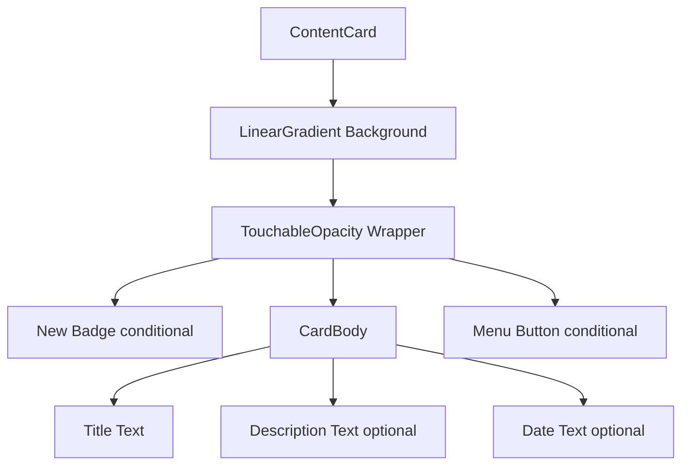
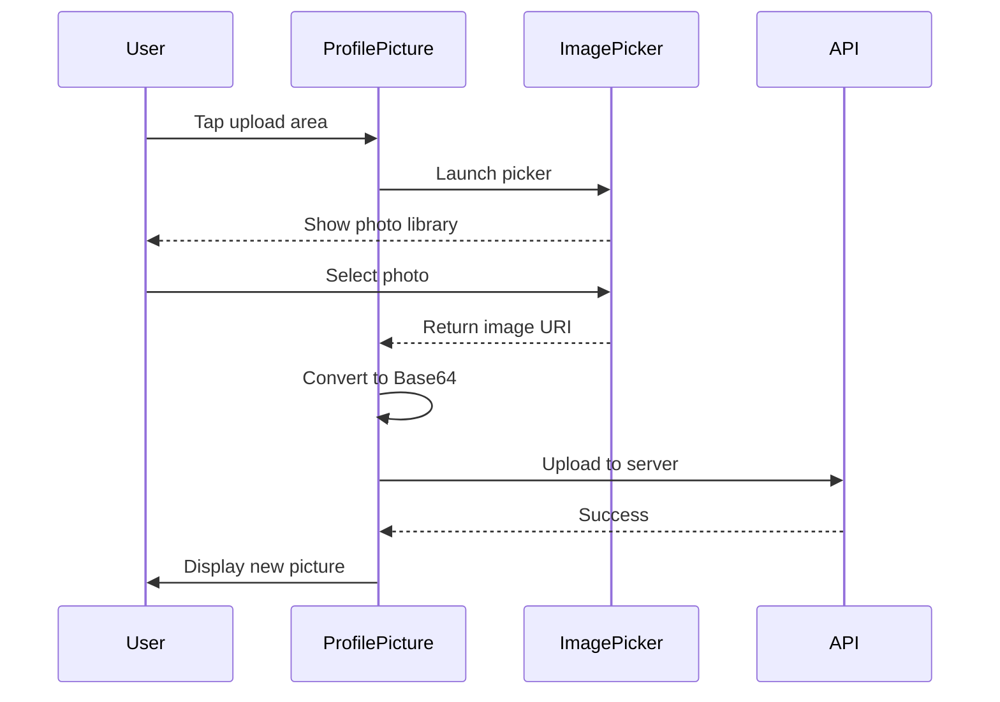

# Component Library

## Overview

This document catalogs all reusable components in the `/components/` directory. These are atomic, presentation-focused components used throughout the application for consistent UI and behavior.

---

## ContentCard

**Path**: `/components/ContentCard.tsx`
**Purpose**: Display individual content items in carousels
**Usage**: HomePage carousels

### Props

```typescript
interface ContentCardProps {
  title: string;                 // Video/content title
  description?: string;          // Optional description
  dateUploaded?: string;         // Upload date (formatted)
  isPrime?: boolean;             // Premium content flag
  showMenu?: boolean;            // Show 3-dot menu
  showNewBadge?: boolean;        // Show "New Episode" badge
  onPress?: () => void;          // Card tap handler
  onMenuPress?: () => void;      // Menu tap handler
}
```

### Visual Design

- **Gradient Background**: Different gradients for prime vs regular content
- **Size**: ~70% screen width (`width * 0.7`)
- **Min Height**: 180px
- **Border Radius**: 12px

### Features

- Pure functional component (no side effects)
- Theme-aware colors
- Optional "New Episode" badge (top-left)
- Optional menu button (top-right)
- Date formatting utility
- Accessible touch targets

### Usage Example

```typescript
<ContentCard
  title="Episode 5: The Journey"
  description="An epic adventure continues..."
  dateUploaded="2026-01-25"
  isPrime={true}
  showNewBadge={true}
  showMenu={false}
  onPress={() => navigateToVideo(videoId)}
/>
```

### Component Structure



---

## ContentCarousel

**Path**: `/components/ContentCarousel.tsx`
**Purpose**: Horizontal scrolling carousel for content cards
**Usage**: HomePage sections (New Episodes, Popular, Recommended)

### Props

```typescript
interface ContentCarouselProps {
  title?: string;                    // Section title
  data: ContentItem[];               // Array of content items
  renderItem: (item) => JSX.Element; // Render function for each item
  keyExtractor?: (item, index) => string;
}
```

### Features

- **Horizontal ScrollView**: Smooth scrolling
- **Consistent Spacing**: Gaps between cards
- **Performance**: Lazy rendering for off-screen items
- **Section Title**: Optional heading above carousel

### Usage Example

```typescript
<ContentCarousel
  title="New Episodes"
  data={newEpisodes}
  renderItem={(item) => (
    <ContentCard
      title={item.title}
      isPrime={item.isPrime}
      showNewBadge={true}
      onPress={() => handleCardPress(item)}
    />
  )}
  keyExtractor={(item) => item.id}
/>
```

---

## ProfilePicture

**Path**: `/components/ProfilePicture.tsx`
**Purpose**: Display and upload user profile pictures
**Usage**: Settings Hub, My Info Screen

### Props

```typescript
interface ProfilePictureProps {
  imageUri?: string | null;      // Current profile picture URI
  size?: number;                 // Image size (default: 120)
  editable?: boolean;            // Allow upload (default: true)
  onImageChange?: (uri: string) => void; // Callback after upload
}
```

### Features

- **Circular Display**: Border radius 50%
- **Upload Functionality**: Tap to select new photo
- **Image Picker Integration**: Uses `expo-image-picker`
- **Base64 Conversion**: Converts image for API upload
- **Default Avatar**: Shows placeholder if no image
- **Loading State**: ActivityIndicator during upload

### Upload Flow



### Usage Example

```typescript
<ProfilePicture
  imageUri={profile?.profilePicture}
  size={120}
  editable={true}
  onImageChange={(uri) => handleProfilePictureUpdate(uri)}
/>
```

---

## ThemedText

**Path**: `/components/ThemedText.tsx`
**Purpose**: Text component with automatic theme support
**Usage**: Throughout app for consistent typography

### Props

```typescript
interface ThemedTextProps extends TextProps {
  type?: 'default' | 'title' | 'subtitle' | 'link';
  lightColor?: string;
  darkColor?: string;
}
```

### Features

- **Automatic Theme**: Detects dark/light mode
- **Predefined Types**: Default, title, subtitle, link styles
- **Custom Colors**: Override theme colors if needed
- **Inherits TextProps**: All standard Text props supported

### Usage Example

```typescript
<ThemedText type="title">Welcome to Millennials Prime</ThemedText>
<ThemedText type="default">Your content feed</ThemedText>
<ThemedText type="link" onPress={handlePress}>Learn More</ThemedText>
```

---

## ThemedView

**Path**: `/components/ThemedView.tsx`
**Purpose**: View component with automatic theme support
**Usage**: Container components throughout app

### Props

```typescript
interface ThemedViewProps extends ViewProps {
  lightColor?: string;
  darkColor?: string;
}
```

### Features

- **Automatic Background**: Theme-aware background color
- **Custom Colors**: Override theme if needed
- **Inherits ViewProps**: All standard View props supported

### Usage Example

```typescript
<ThemedView style={styles.container}>
  <ThemedText>Content here</ThemedText>
</ThemedView>
```

---

## ParallaxScrollView

**Path**: `/components/ParallaxScrollView.tsx`
**Purpose**: Scrollable view with parallax header effect
**Usage**: Feature pages, content detail screens (future)

### Props

```typescript
interface ParallaxScrollViewProps {
  headerImage: ReactElement;
  headerBackgroundColor?: { dark: string; light: string };
  children: ReactNode;
}
```

### Features

- **Parallax Effect**: Header image moves slower than content
- **Smooth Animation**: Uses Animated API
- **Theme-Aware**: Background color for dark/light mode
- **Collapsible Header**: Header shrinks on scroll

### Usage Example

```typescript
<ParallaxScrollView
  headerImage={<Image source={headerImg} />}
  headerBackgroundColor={{ dark: '#000', light: '#fff' }}
>
  <Text>Content here</Text>
</ParallaxScrollView>
```

---

## Header

**Path**: `/components/Header.tsx`
**Purpose**: Generic header component
**Usage**: Screen headers

### Props

```typescript
interface HeaderProps {
  title: string;
  showBack?: boolean;
  onBackPress?: () => void;
  rightAction?: ReactElement;
}
```

### Features

- **Title Display**: Centered or left-aligned
- **Back Button**: Optional back navigation
- **Right Action**: Custom button/component on right side
- **Theme Support**: Adapts to color scheme

---

## Collapsible

**Path**: `/components/Collapsible.tsx`
**Purpose**: Expandable/collapsible section
**Usage**: FAQ, settings sections (future)

### Props

```typescript
interface CollapsibleProps {
  title: string;
  children: ReactNode;
  defaultExpanded?: boolean;
}
```

### Features

- **Expand/Collapse**: Tap to toggle
- **Animated Transition**: Smooth height animation
- **Chevron Indicator**: Shows expanded state
- **Controlled State**: Optional external control

---

## ExternalLink

**Path**: `/components/ExternalLink.tsx`
**Purpose**: Link that opens external URLs in browser
**Usage**: Social links, documentation links

### Props

```typescript
interface ExternalLinkProps {
  href: string;
  children: ReactNode;
}
```

### Features

- **External Navigation**: Opens in system browser
- **Link Styling**: Underlined, colored text
- **Tap Handler**: Uses `Linking.openURL()`

---

## ErrorBoundary

**Path**: `/components/ErrorBoundary.tsx`
**Purpose**: Catch and display React errors
**Usage**: Wraps app sections for error handling

### Props

```typescript
interface ErrorBoundaryProps {
  children: ReactNode;
  fallback?: ReactElement;
}
```

### Features

- **Error Catching**: Catches component tree errors
- **Fallback UI**: Custom error display
- **Error Logging**: Logs to console/service
- **Recovery**: Reset button to retry

---

## TabBarIcon

**Path**: `/components/navigation/TabBarIcon.tsx`
**Purpose**: Icons for tab bar navigation
**Usage**: Tab navigator configuration

### Props

```typescript
interface TabBarIconProps {
  name: string;           // Icon name from Ionicons
  color: string;          // Icon color
  focused?: boolean;      // Tab active state
}
```

### Features

- **Ionicons Integration**: Uses Expo vector icons
- **Size Consistency**: Standard size across tabs
- **Color Support**: Theme-aware coloring
- **Focus State**: Visual indicator for active tab

---

## Component Usage Summary

| Component | Screens Used | Purpose |
|-----------|--------------|---------|
| ContentCard | HomePage | Video content display |
| ContentCarousel | HomePage | Horizontal scrolling sections |
| ProfilePicture | Settings, MyInfo | Profile image upload/display |
| ThemedText | All screens | Consistent text styling |
| ThemedView | All screens | Consistent containers |
| ParallaxScrollView | Future: Detail screens | Engaging scroll effects |
| Header | Custom headers | Screen titles and navigation |
| Collapsible | Future: Settings | Expandable sections |
| ExternalLink | Future: About, Help | External navigation |
| ErrorBoundary | Root level | Error handling |
| TabBarIcon | Tab navigation | Tab bar icons |

---

## Best Practices

### Component Design Principles

1. **Pure Components**: Avoid side effects in render
2. **Props Over State**: Prefer controlled components
3. **Theme Awareness**: Use color scheme hook
4. **Accessibility**: Add labels and hints
5. **Performance**: Memoize expensive components
6. **Reusability**: Generic, configurable props

### Styling Conventions

- Use `globalStyles` for consistency
- Theme colors from `COLORS` constant
- Responsive sizing (percentage-based)
- Platform-specific adjustments where needed

### Import Pattern

```typescript
import ContentCard from '@/components/ContentCard';
import { ThemedText, ThemedView } from '@/components/Themed';
```

---

*Component library as of 2026-01-30*
