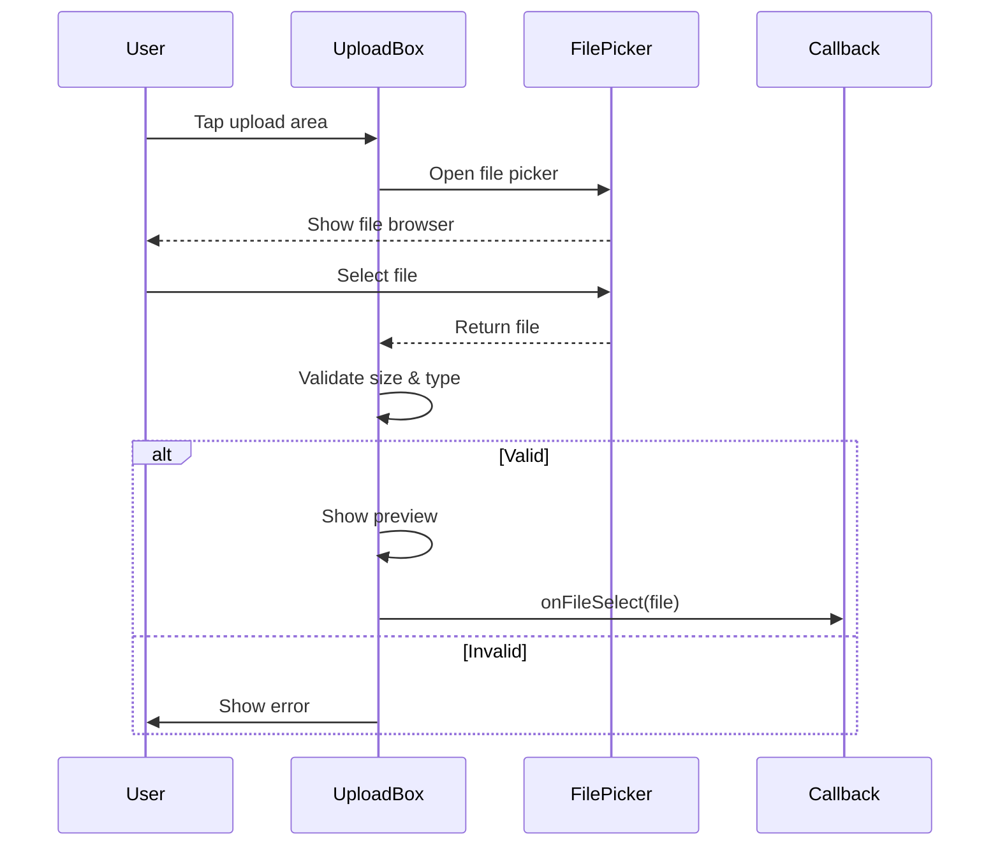

# Shared Components

## Overview

This document catalogs shared components in the `/shared/` directory. These are feature-specific, composite components used across multiple screens for complex UI patterns like posts, user displays, modals, and uploads.

---

## Post Components

**Directory**: `/shared/PostComponents/`

### PrimeNewsPost

**File**: `/shared/PostComponents/PrimeNewsPost.tsx`
**Purpose**: Featured video post with large display
**Usage**: HomePage hero section

**Features**:
- Large video player integration (Bunny CDN)
- Title and description overlay
- Author information display
- Prime/admin badges
- Video playback controls

**Props**:
```typescript
{
  name: string;          // Author name
  title: string;         // Post title
  description: string;   // Post description
  prime: boolean;        // Prime member flag
  admin: boolean;        // Admin flag
  libraryId: number;     // Bunny CDN library ID
  videoId: string;       // Video UUID
  authorId: string;      // Author user ID
}
```

---

### TextPost

**File**: `/shared/PostComponents/TextPost.tsx`
**Purpose**: Text-only post display
**Usage**: My Profile Screen, Social Feed (hidden)

**Features**:
- Title and description (max 10 lines)
- Author info with badges
- Like/comment/share buttons (future)
- Timestamp display

**Props**:
```typescript
{
  name: string;
  title: string;
  description: string;
  prime: boolean;
  admin: boolean;
  authorId: string;
}
```

---

### PicturePost

**File**: `/shared/PostComponents/PicturePost.tsx`
**Purpose**: Image post with caption
**Usage**: My Profile Screen, Social Feed (hidden)

**Features**:
- Full-width image display
- Title and description (2 lines max)
- Image loading state
- Author info with badges

**Props**:
```typescript
{
  name: string;
  title: string;
  description: string;
  picture: string;       // Image URL
  prime: boolean;
  admin: boolean;
  authorId: string;
}
```

---

### VideoPost

**File**: `/shared/PostComponents/VideoPost.tsx`
**Purpose**: Video post with Bunny CDN integration
**Usage**: My Profile Screen, Social Feed (hidden)

**Features**:
- Bunny CDN video player
- Title and description
- Video thumbnail
- Play button overlay
- Author info with badges

**Props**:
```typescript
{
  name: string;
  title: string;
  description: string;
  prime: boolean;
  admin: boolean;
  libraryId: number;
  videoId: string;
  authorId: string;
}
```

---

## User Components

**Directory**: `/shared/ConnectedUser/`

### User

**File**: `/shared/ConnectedUser/User.tsx`
**Purpose**: User card display with status badges
**Usage**: Connected Users Screen (hidden)

**Features**:
- User name and industry display
- **Status Badges**:
  - Admin badge (red/orange)
  - Prime member badge (purple/gold)
  - Matching indicator (green)
  - Connection status (blue)
- Pressable card for user profile navigation

**Props**:
```typescript
{
  name: string;        // User display name
  industry: string;    // User's industry/profession
  connected: boolean;  // Connection status
  matching: boolean;   // Industry/interest match
  prime: boolean;      // Prime member status
  admin: boolean;      // Admin status
}
```

**Badge Colors**:
- **Admin**: Red/orange background
- **Prime**: Purple/gold background
- **Matching**: Green indicator
- **Connected**: Blue checkmark

---

### ConnectedUserInfo

**File**: `/shared/ConnectedUser/ConnectedUserInfo.tsx`
**Purpose**: Detailed user information display
**Usage**: User profile pages (hidden)

**Features**:
- Extended user details
- Profile picture
- Bio/description
- Connection actions
- Social stats (followers, connections)

---

## E-Commerce Components

**Directory**: `/shared/EComm/`

### Item

**File**: `/shared/EComm/Item.tsx`
**Purpose**: Product/item card for marketplace
**Usage**: E-Commerce Screen (hidden)

**Features**:
- Item image display
- Title and description
- Price display (future)
- Add to cart button (future)
- Item rating (future)

**Props**:
```typescript
{
  title: string;
  description: string;
  imageUrl: string;
  price?: number;
  rating?: number;
}
```

---

## Modal Components

**Directory**: `/shared/Modals/`

### CustomBottomSheet

**File**: `/shared/Modals/CustomBottomSheet.tsx`
**Purpose**: Reusable bottom sheet modal
**Usage**: E-Commerce item details, action menus (future)

**Features**:
- Slide-up animation
- Draggable to dismiss
- Backdrop dim effect
- Customizable content area
- Snap points configuration

**Props**:
```typescript
{
  isVisible: boolean;
  onClose: () => void;
  snapPoints?: string[];
  children: ReactNode;
}
```

**Usage Example**:
```typescript
<CustomBottomSheet
  isVisible={showSheet}
  onClose={() => setShowSheet(false)}
  snapPoints={['25%', '50%', '90%']}
>
  <ItemDetails item={selectedItem} />
</CustomBottomSheet>
```

---

### CommentModal

**File**: `/shared/Modals/CommentModal.tsx`
**Purpose**: Modal for viewing and adding comments
**Usage**: Post interactions (future)

**Features**:
- Comment list display
- Add comment input
- User avatars
- Timestamp display
- Nested replies (future)

---

## Upload Components

**Directory**: `/shared/Upload/`

### UploadBox

**File**: `/shared/Upload/UploadBox.tsx`
**Purpose**: File upload interface
**Usage**: Upload Content Screen (hidden)

**Features**:
- **Drag and drop area** (web) / Tap to select (mobile)
- **File type filtering**: Images, videos, documents
- **Upload progress indicator**
- **Preview display**: Shows selected file
- **Multiple file support** (future)
- **Validation**: Size and type checking

**Props**:
```typescript
{
  onFileSelect: (file: File) => void;
  acceptedTypes?: string[];
  maxSizeM?: number;
  multiple?: boolean;
}
```

**Upload Flow**:


---

## Timer Components

**Directory**: `/shared/Timer/`

### HMSTimer

**File**: `/shared/Timer/HMSTimer.tsx`
**Purpose**: Hours:Minutes:Seconds countdown timer
**Usage**: Timed events, limited offers (future)

**Features**:
- Hours, minutes, seconds display
- Countdown functionality
- Completion callback
- Pause/resume

---

### DHMSTimer

**File**: `/shared/Timer/DHMSTimer.tsx`
**Purpose**: Days:Hours:Minutes:Seconds countdown
**Usage**: Long-duration countdowns (future)

**Features**:
- Days, hours, minutes, seconds display
- Extended countdown support
- Auto-refresh
- Expiration handler

---

### NumberCard

**File**: `/shared/Timer/NumberCard.tsx`
**Purpose**: Animated number display for timers
**Usage**: Used by HMSTimer and DHMSTimer

**Features**:
- Flip animation on number change
- Customizable styling
- Responsive sizing

---

## Utility Components

### Ad

**File**: `/shared/Ad.tsx`
**Purpose**: Advertisement display component
**Usage**: Future monetization

**Features**:
- Ad banner display
- Multiple ad formats
- Click tracking
- Ad blocking detection (future)

---

### LikeComment

**File**: `/shared/LikeComment.tsx`
**Purpose**: Like, comment, share action buttons
**Usage**: Post interactions (future)

**Features**:
- Like button with count
- Comment button with count
- Share button
- Animation on interaction
- State management

**Props**:
```typescript
{
  likes: number;
  comments: number;
  shares: number;
  onLike: () => void;
  onComment: () => void;
  onShare: () => void;
  isLiked?: boolean;
}
```

---

## Component Usage Matrix

| Component | Screens | Status | Purpose |
|-----------|---------|--------|---------|
| **PrimeNewsPost** | HomePage | Active | Featured video hero |
| **TextPost** | MyProfile | Hidden | Text-only posts |
| **PicturePost** | MyProfile | Hidden | Image posts |
| **VideoPost** | MyProfile | Hidden | Video posts |
| **User** | ConnectedUsers | Hidden | User cards with badges |
| **ConnectedUserInfo** | User Profile | Hidden | Detailed user info |
| **Item** | E-Commerce | Hidden | Product cards |
| **CustomBottomSheet** | E-Commerce | Hidden | Modal dialogs |
| **CommentModal** | Post screens | Future | Comment threads |
| **UploadBox** | Upload | Hidden | File upload UI |
| **HMSTimer** | Future | Future | Countdown timers |
| **DHMSTimer** | Future | Future | Long countdowns |
| **Ad** | Future | Future | Advertisements |
| **LikeComment** | Posts | Future | Interaction buttons |

---

## Component Patterns

### Badge System

Used across User and Post components:

```typescript
// Admin Badge
{admin && <Badge color="red" text="Admin" />}

// Prime Badge
{prime && <Badge color="purple" text="Prime" />}

// Matching Badge
{matching && <Badge color="green" icon="checkmark" />}
```

### Post Component Pattern

All post components share common structure:
1. **Header**: Author info, name, badges
2. **Body**: Content (text, image, or video)
3. **Footer**: Like/comment/share buttons (future)
4. **Metadata**: Timestamp, author ID

### Modal Pattern

Consistent modal implementation:
- Bottom sheet for mobile-friendly UX
- Backdrop tap to dismiss
- Swipe down to close
- Snap points for partial/full display

---

## Best Practices

### Shared Component Guidelines

1. **Composition**: Build complex UI from smaller shared components
2. **Consistency**: Use shared components for uniform UX
3. **Feature Grouping**: Group related components in subdirectories
4. **Props Validation**: TypeScript interfaces for all props
5. **Theme Support**: All components support dark/light mode
6. **Accessibility**: ARIA labels and hints where applicable

### Import Pattern

```typescript
// Post components
import { PrimeNewsPost, TextPost, VideoPost } from '@/shared/PostComponents';

// User components
import User from '@/shared/ConnectedUser/User';

// Modals
import CustomBottomSheet from '@/shared/Modals/CustomBottomSheet';

// Upload
import UploadBox from '@/shared/Upload/UploadBox';
```

---

*Shared components documented as of 2026-01-30*
