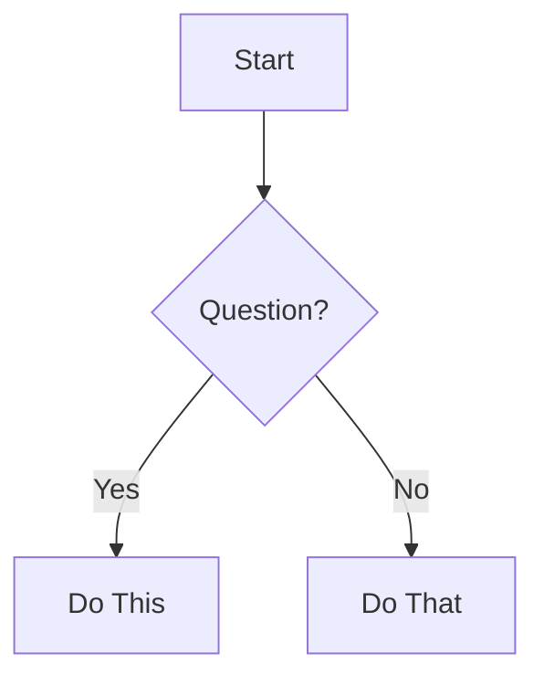
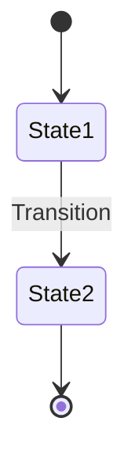
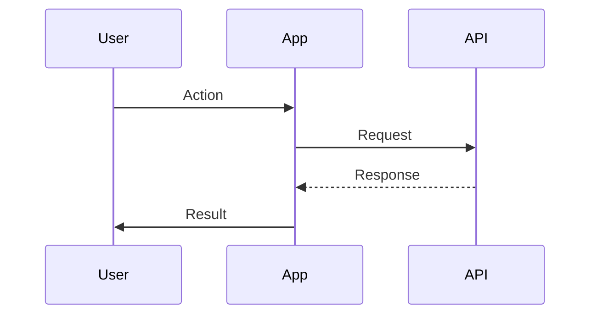

# User Journeys

High-level user flow diagrams showing navigation paths, decision points, and user experiences throughout the MillennialsPrimeAPP.

## Available User Journeys

### [Onboarding & Authentication Flow](./onboarding-flow.md) ✅
**Purpose**: Complete user onboarding from first launch to authentication
**Covers**:
- Welcome screen entry
- Registration flow (Firebase + MongoDB dual auth)
- Login flow with validation
- Password recovery branch
- Error recovery paths

**Key Paths**:
- New user registration: ~8 steps, 3-5 minutes
- Existing user login: ~5 steps, ~30 seconds
- Password recovery: ~4 steps in-app + email processing

---

### [Main Navigation Flow](./main-navigation-flow.md) ✅
**Purpose**: Active feature navigation for authenticated users
**Covers**:
- Home Tab (video content browsing)
- Settings Tab (profile management)
- LogOut Tab (session termination)
- Tab switching patterns
- Content interaction points

**Key Insights**:
- Home tab: Primary engagement point
- Settings: One-time setup + occasional updates
- Sequential vs direct navigation patterns

---

### [Settings Workflow](./settings-workflow.md) ✅
**Purpose**: Detailed 3-step form workflow
**Covers**:
- Personal Info → Business Info → Art Info
- Conditional field logic (entrepreneur yes/no, artist yes/no)
- Data persistence to MongoDB
- Entry points (sequential vs direct)

**Completion Paths**:
- Minimal: ~3 minutes (no conditionals)
- Average: ~5-7 minutes (one conditional)
- Maximum: ~10-15 minutes (both conditionals)

---

### [Future Features Flow](./future-features-flow.md) ✅
**Purpose**: Hidden but production-ready features
**Covers**:
- Social Tab (5 screens, 85% ready)
- Upload Tab (1 screen, 60% ready)
- Shows Tab (2 screens, 65% ready)
- Feature enablement process
- Readiness assessment

**Business Value**:
- Progressive rollout strategy
- Phased launch plan (Q2-Q4 2026)
- Risk mitigation through feature toggles

---

## Diagram Types Used

### Flowchart (flowchart TD/LR)

**Used for**: Navigation flows, decision trees

### State Diagram (stateDiagram-v2)

**Used for**: Form workflows, screen states

### Sequence Diagram (sequenceDiagram)

**Used for**: Authentication flows, API interactions

## Visual Legend

### Status Colors
- 🟢 **Green**: Active features, success paths
- 🔵 **Blue**: Standard navigation, info
- 🟣 **Purple**: Premium/featured content
- 🔴 **Red**: Errors, logout, destructive actions
- 🟠 **Orange**: Warnings, optional paths
- ⚪ **Dashed Lines**: Hidden/future features

### Common Symbols
- `[*]` - Start/end state
- `{Decision}` - Decision point (diamond)
- `-->` - Flow direction
- `-.->` - Future/hidden feature flow
- `subgraph` - Feature grouping

## Business Insights

### User Engagement Patterns
- **Onboarding**: Multi-step with validation gates
- **Daily Usage**: Home tab browsing, quick access
- **Profile Setup**: One-time investment, progressive completion
- **Feature Discovery**: Hidden features ready for staged launch

### Critical Decision Points
- Welcome: Login vs Register
- Registration: Firebase success → MongoDB (cleanup on fail)
- Settings: Entrepreneur yes/no → Conditional fields
- Settings: Artist yes/no → 14+ conditional fields

### Drop-off Risk Areas
1. Registration: Long form with age gate
2. Settings workflow: Multi-step, many fields
3. Art screen: 14 fields for artists

## For Business Stakeholders

### Review Focus Areas
1. **Onboarding Flow**: First impression, conversion funnel
2. **Main Navigation**: Daily user experience
3. **Settings Workflow**: Profile completion rates
4. **Future Features**: Launch readiness and strategy

### Discussion Questions
- Does onboarding flow match brand experience?
- Are settings forms too long/complex?
- Which hidden feature should launch first?
- What's missing from user journeys?

## For Product Managers

### Metrics to Track
- **Onboarding**:
  - Registration completion rate
  - Time to first login
  - Password recovery usage

- **Navigation**:
  - Tab usage distribution
  - Session duration per tab
  - Feature engagement

- **Settings**:
  - Form completion rates (step 1 vs 2 vs 3)
  - Drop-off points
  - Profile completeness

- **Hidden Features**:
  - Beta test engagement
  - Feature adoption rates
  - User feedback

## For Developers

### Implementation References
Each user journey links to:
- Relevant wireframes (component structure)
- Architecture docs (tech stack, patterns)
- Component docs (reusable components)

### Navigation Patterns
- Tab navigation (instant switching)
- Stack navigation (push/replace/back)
- Modal navigation (bottom sheets)
- Auth gating (root layout guard)

---

*User journeys documented as of 2026-01-30*
