# Future Features Flow (Hidden Tabs)

## Overview

This diagram illustrates the navigation and functionality of three fully-implemented but currently hidden features: Social Tab, Upload Tab, and Shows Tab. These features are production-ready but disabled via `href: null` in the tab configuration, allowing for progressive feature release.

## Hidden Features Overview

```mermaid
flowchart TD
    FutureRelease([Future Feature Release]) -.-> SocialTab
    FutureRelease -.-> UploadTab
    FutureRelease -.-> ShowsTab

    subgraph Social["Social Tab (Hidden - 5 Screens)"]
        SocialTab[Social Feed Index] -.-> ConnectedUsers[Connected Users Screen]
        SocialTab -.-> MyProfile[My Profile Screen]
        SocialTab -.-> EComm[E-Commerce Screen]
        SocialTab -.-> UserProfile[User Profile: /id]

        ConnectedUsers -.-> UserList[List of Users with Badges]
        UserList -.-> AdminBadge[Admin Badge]
        UserList -.-> PrimeBadge[Prime Member Badge]
        UserList -.-> MatchingStatus[Matching Indicator]
        UserList -.-> ConnectionStatus[Connection Status]

        MyProfile -.-> PostTypes[Post Types]
        PostTypes -.-> TextPost[Text Post Component]
        PostTypes -.-> PicturePost[Picture Post Component]
        PostTypes -.-> VideoPost[Video Post Component]

        EComm -.-> BottomSheet[Bottom Sheet Modal]
        BottomSheet -.-> ItemList[Item Listings]
        ItemList -.-> ItemDetails[Item Details]

        UserProfile -.-> DynamicProfile[Dynamic User Profile by ID]
    end

    subgraph Upload["Upload Tab (Hidden - 1 Screen)"]
        UploadTab[Upload Content Screen] -.-> UploadBox[Upload Box Component]
        UploadBox -.-> FilePicker[File Selection]
        FilePicker -.-> ImagePicker[Image Picker]
        ImagePicker -.-> ServerUpload[Upload to Server]
    end

    subgraph Shows["Shows Tab (Hidden - 2 Screens)"]
        ShowsTab[Shows List] -.-> ShowView[Show View Screen]
        ShowView -.-> EpisodeList[Episode Listing]
        ShowView -.-> PrimeShow[Prime Show Player]
        PrimeShow -.-> WebViewStream[WebView Streaming]
    end

    style SocialTab stroke-dasharray: 5 5
    style UploadTab stroke-dasharray: 5 5
    style ShowsTab stroke-dasharray: 5 5
    style ConnectedUsers stroke-dasharray: 5 5
    style MyProfile stroke-dasharray: 5 5
    style EComm stroke-dasharray: 5 5
    style UserProfile stroke-dasharray: 5 5
    style UploadBox stroke-dasharray: 5 5
    style ShowView stroke-dasharray: 5 5
    style PrimeShow stroke-dasharray: 5 5
```



## Social Tab Features (5 Screens)

### 1. Social Feed Index
**Purpose**: Navigation hub for social features
**Status**: UI complete with mock data
**Readiness**: 85%

**Features**:
- Navigation buttons to other social screens
- User role display (admin/prime status)
- Connection count display

**Flow**:
```
Social Feed → [Connected Users | My Profile | E-Commerce | User Profile/ID]
```

---

### 2. Connected Users Screen
**Purpose**: Display list of connected users with status badges
**Status**: Complete with hardcoded data
**Readiness**: 85%

**Features**:
- **User Cards** with:
  - Name and industry
  - Admin badge (if admin)
  - Prime member badge (if premium)
  - Connection status (connected/not connected)
  - Matching indicator (matching industry/interests)

**Current Implementation**:
```
12 Hardcoded Users:
- 4 Admin users
- 4 Prime users
- 4 Normal users
```

**To Enable**:
- Replace mock data with API call
- Implement user connection logic
- Add real-time updates

---

### 3. My Profile Screen
**Purpose**: User's own profile with posts
**Status**: Complete with mock posts
**Readiness**: 80%

**Features**:
- **Post Types**:
  - TextPost: Title + description (max 10 lines)
  - PicturePost: Image + title + description (2 lines max)
  - VideoPost: Bunny CDN video + title + description

**Post Display**:
- Scrollable feed of user's content
- Prime/admin badges on posts
- Author attribution

**To Enable**:
- Connect to user's actual posts API
- Implement post creation flow
- Add edit/delete functionality

---

### 4. E-Commerce Screen
**Purpose**: Marketplace with item listings
**Status**: UI complete with bottom sheet modal
**Readiness**: 60%

**Features**:
- **Bottom Sheet UI** for item display
- Item cards with:
  - Item image
  - Title and description
  - Price (future)
  - Purchase button (placeholder)

**To Enable**:
- Implement item catalog API
- Add payment integration
- Implement purchase flow
- Add shopping cart

---

### 5. Dynamic User Profile ([id] route)
**Purpose**: View other users' profiles
**Status**: Component ready, needs data
**Readiness**: 70%

**Features**:
- **Dynamic Routing**: `/user/[id]` pattern
- User-specific profile data
- Posts feed for selected user
- Connection actions (future)

**To Enable**:
- Implement user profile API endpoint
- Add connection request functionality
- Implement follow/unfollow

---

## Upload Tab Features (1 Screen)

### Upload Content Screen
**Purpose**: File upload interface for user-generated content
**Status**: UI complete, backend integration needed
**Readiness**: 60%

**Features**:
- **UploadBox Component**:
  - File selection UI
  - Image picker integration (expo-image-picker)
  - Upload progress indicator (placeholder)
  - Server upload logic (placeholder)

**Supported Content**:
- Images (JPEG, PNG)
- Videos (future: MP4, MOV)
- Documents (future: PDF)

**Flow**:
```
Upload Tab → Tap Upload Area → Image Picker → Select File → Upload Progress → Success/Error
```

**To Enable**:
- Implement server upload endpoint
- Add file size/type validation
- Implement upload progress tracking
- Add content moderation workflow
- Connect to Bunny CDN for video uploads

---

## Shows Tab Features (2 Screens)

### 1. Prime Show (WebView Streaming)
**Purpose**: Premium show streaming with WebView
**Status**: Complete with WebView integration
**Readiness**: 90%

**Features**:
- **WebView Integration**: Full-screen video playback
- **Drawer Navigation**: Accessible from side menu
- Premium content badge
- Streaming controls

**To Enable**:
- Add show content library
- Implement playback analytics
- Add subscription gating (if premium-only)

---

### 2. Show View Screen (Episodes List)
**Purpose**: Display show details and episode listings
**Status**: Placeholder implementation
**Readiness**: 40%

**Features** (Planned):
- Show metadata (title, description, thumbnail)
- Episode list with:
  - Episode numbers
  - Titles and descriptions
  - Duration
  - Thumbnails
- Navigate to PrimeShow for playback

**To Enable**:
- Complete ShowViewScreen implementation
- Create show/episode data model
- Implement episode selection
- Connect to streaming backend

---

## Feature Enablement Process

### Step-by-Step Activation

**File to Edit**: `app/(tabs)/_layout.tsx`

**Social Tab** (Line ~103):
```typescript
// Before (Hidden)
<Tabs.Screen
  name="(social)"
  options={{
    href: null,  // 🚫 Hidden
    // tabBarIcon: ({ color }) => <TabBarIcon name="people" color={color} />,
    // title: "Social",
  }}
/>

// After (Enabled)
<Tabs.Screen
  name="(social)"
  options={{
    tabBarIcon: ({ color }) => <TabBarIcon name="people" color={color} />,
    title: "Social",
  }}
/>
```

**Upload Tab** (Line ~125):
```typescript
// Remove href: null
// Uncomment tabBarIcon and title
```

**Shows Tab** (Line ~145):
```typescript
// Remove href: null
// Uncomment tabBarIcon and title
```

### Deployment Checklist

- [ ] Complete API integration for feature
- [ ] Replace mock data with real data
- [ ] Test all user flows
- [ ] Verify dark/light mode compatibility
- [ ] Run E2E tests
- [ ] Code review
- [ ] QA testing in staging
- [ ] Monitor error rates post-launch

---

## Readiness Assessment

| Feature | UI Complete | API Integration | Testing | Readiness |
|---------|-------------|-----------------|---------|-----------|
| **Social Tab** |
| Connected Users | ✅ | ⏳ Partial | ⏳ Needed | 85% |
| My Profile | ✅ | ⏳ Partial | ⏳ Needed | 80% |
| E-Commerce | ✅ | ❌ Needed | ⏳ Needed | 60% |
| User Profile [id] | ✅ | ⏳ Partial | ⏳ Needed | 70% |
| Social Feed | ✅ | ⏳ Partial | ⏳ Needed | 85% |
| **Upload Tab** |
| Upload Screen | ✅ | ❌ Needed | ⏳ Needed | 60% |
| **Shows Tab** |
| Prime Show | ✅ | ✅ Complete | ⏳ Needed | 90% |
| Show View | ⚠️ Partial | ❌ Needed | ❌ Not Started | 40% |

**Legend**: ✅ Complete | ⏳ In Progress | ❌ Not Started | ⚠️ Partial

---

## Business Impact Analysis

### Social Tab Launch
**Estimated Impact**: High engagement, community building
**Prerequisites**:
- User connection API
- Real-time notifications (future)
- Content moderation system
- E-commerce payment integration

**Expected Metrics**:
- Daily active users increase
- User retention improvement
- Community engagement (connections, posts)

### Upload Tab Launch
**Estimated Impact**: Medium engagement, UGC growth
**Prerequisites**:
- File storage solution (Bunny CDN/S3)
- Content moderation workflow
- Upload quota/limits

**Expected Metrics**:
- User-generated content volume
- Upload success rates
- Content quality/moderation needs

### Shows Tab Launch
**Estimated Impact**: High value for premium content
**Prerequisites**:
- Show content library
- Episode metadata API
- Streaming infrastructure

**Expected Metrics**:
- Premium show viewership
- Episode completion rates
- Subscription conversions (if premium-only)

---

## Progressive Rollout Strategy

### Phase 1: Social Tab (Q2 2026)
1. Complete API integrations
2. Beta test with select users
3. Enable for all users
4. Monitor engagement metrics

### Phase 2: Upload Tab (Q3 2026)
1. Implement upload backend
2. Add content moderation
3. Beta test upload flow
4. Full rollout

### Phase 3: Shows Tab (Q4 2026)
1. Complete ShowViewScreen
2. Populate show library
3. Test streaming performance
4. Launch premium shows

---

## Related Documentation

- [Feature Status](../architecture/FEATURE_STATUS.md) - Detailed readiness assessment
- [Navigation Structure](../architecture/NAVIGATION_STRUCTURE.md) - How hidden tabs work

---

*Future features documented as of 2026-01-30*
