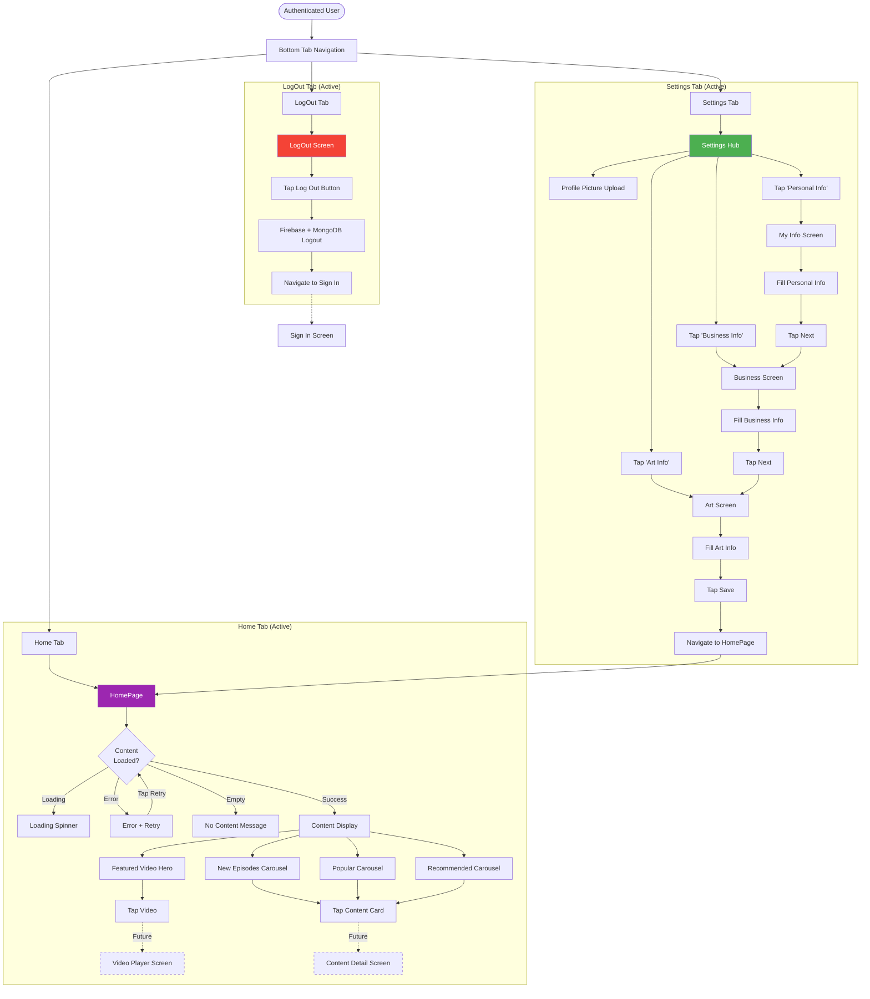

# Main Navigation Flow (Active Features)

## Overview

This diagram shows the navigation structure for authenticated users across active features: Home tab (video content), Settings tab (profile management), and LogOut tab. Represents the current production user experience.

## Flow Diagram



## Tab Navigation Structure

### Home Tab (Purple)
**Purpose**: Main content consumption
**Key Screens**: HomePage
**User Goal**: Browse and watch video content

**Features**:
- Featured video hero section
- 3 content carousels (New, Popular, Recommended)
- Bunny CDN video streaming
- Loading/error states

### Settings Tab (Green)
**Purpose**: Profile management
**Key Screens**: Settings Hub, My Info, Business, Art
**User Goal**: Complete and update profile information

**Features**:
- Profile picture upload
- 3-step sequential form workflow
- Data persistence to MongoDB
- Validation and error handling

### LogOut Tab (Red)
**Purpose**: Session termination
**Key Screens**: LogOut Screen
**User Goal**: Sign out securely

**Features**:
- Dual authentication cleanup
- Secure token removal
- Auto-redirect to sign-in

## User Journeys

### Journey 1: Content Browsing
```
Auth → Home Tab → Browse Carousels → Select Video → (Future: Watch)
```
**Duration**: Ongoing browsing session
**Frequency**: Daily usage

### Journey 2: Profile Setup (First Time)
```
Auth → Settings Tab → Personal Info → Next → Business Info → Next → Art Info → Save → Home
```
**Duration**: 5-10 minutes
**Frequency**: Once (first-time setup) + occasional updates

### Journey 3: Profile Update (Returning)
```
Auth → Settings Tab → Select Specific Form → Update Fields → Save → Home
```
**Duration**: 1-2 minutes
**Frequency**: Occasional

### Journey 4: Session End
```
Any Screen → LogOut Tab → Tap Log Out → Sign In Screen
```
**Duration**: <10 seconds
**Frequency**: End of each session

## Navigation Patterns

### Tab Switching
- **Instant Access**: All tabs accessible from tab bar
- **State Preservation**: Tabs remain mounted (instant switching)
- **No Back Stack**: Tab switching doesn't add to navigation stack

### Stack Navigation (Settings)
- **Sequential Flow**: Personal → Business → Art
- **Back Button**: Available on each screen
- **Skip Ahead**: Can navigate directly to any form from hub

### Authentication Exit
- **LogOut**: Clears session, returns to sign-in
- **Root Layout Guard**: Prevents access to protected routes when logged out

## Screen Transitions

| From | To | Method | Animation |
|------|-----|--------|-----------|
| Any Tab | Another Tab | Tab press | Instant |
| Settings Hub | My Info | router.push() | Slide left |
| My Info | Business | router.push() | Slide left |
| Business | Art | router.push() | Slide left |
| Art | HomePage | router.push() | Replace |
| LogOut | Sign In | router.replace() | Replace |

## Content Interaction Points

### Home Tab Interactions
1. **Tap Featured Video** → Play video (future)
2. **Tap Content Card** → View details (future)
3. **Tap Card Menu** → Show options (share, save, report) (future)
4. **Swipe Carousel** → Browse more content
5. **Tap Retry** → Reload failed content

### Settings Tab Interactions
1. **Tap Profile Picture** → Upload new photo
2. **Tap Nav Button** → Open form
3. **Fill Form** → Input data
4. **Tap Next/Save** → Submit and navigate
5. **Tap Back** → Return to hub

### LogOut Tab Interactions
1. **Tap Log Out** → Confirm and sign out

## Hidden Features (Not in Current Flow)

The following tabs are implemented but hidden (`href: null`):
- **Social Tab** (5 screens) - Social networking features
- **Upload Tab** (1 screen) - Content upload
- **Shows Tab** (2 screens) - Premium show streaming

See [Future Features Flow](./future-features-flow.md) for details.

## Business Insights

### Active Features Adoption
- **Home Tab**: Primary engagement point
- **Settings Tab**: One-time setup + occasional updates
- **LogOut Tab**: Session management

### User Engagement Metrics
- **Home Tab Usage**: Daily active users, video views
- **Settings Completion**: % users who complete all 3 forms
- **Session Duration**: Time between login and logout

### Navigation Bottlenecks
- **Settings Forms**: Multi-step may have drop-off
- **Content Loading**: Errors may frustrate users
- **Video Playback**: Future feature needed for full value

## Related Documentation

- [HomePage Wireframe](../wireframes/02-home-tab/home-page.md)
- [Settings Hub Wireframe](../wireframes/03-settings-tab/settings-hub.md)
- [Settings Workflow Diagram](./settings-workflow.md)
- [LogOut Screen Wireframe](../wireframes/07-other/logout-screen.md)

---

*User journey documented as of 2026-01-30*
