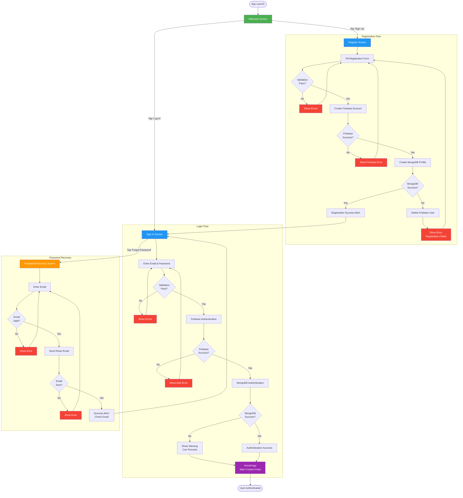

# Onboarding & Authentication Flow

## Overview

This diagram represents the complete user onboarding journey from first app launch through successful authentication. It includes welcome screen, registration, login, and password recovery paths with dual authentication (Firebase + MongoDB).

## Flow Diagram



## Key User Paths

### 1. New User Registration Path
```
Welcome → Register → Fill Form → Firebase Signup → MongoDB Profile → Success → Sign In → Authentication → HomePage
```

**Steps**: 8 steps
**Time**: ~3-5 minutes
**Validation Points**: Form validation, Millennials age check, email uniqueness

### 2. Existing User Login Path
```
Welcome → Sign In → Enter Credentials → Firebase Auth → MongoDB Auth → HomePage
```

**Steps**: 5 steps
**Time**: ~30 seconds
**Validation Points**: Email/password validation, account existence

### 3. Password Recovery Path
```
Sign In → Forgot Password → Enter Email → Send Reset → Check Email → (External: Reset Password) → Sign In → HomePage
```

**Steps**: 4 steps in-app + 1 external
**Time**: ~1-2 minutes in-app + email processing time

## Critical Decision Points

| Decision Point | Options | Impact |
|----------------|---------|--------|
| **Welcome Screen** | Log In / Sign Up | Determines authentication vs registration flow |
| **Firebase Registration** | Success / Failure | Continues to MongoDB or shows error |
| **MongoDB Registration** | Success / Failure | Completes registration or triggers cleanup |
| **MongoDB Authentication** | Success / Failure | Full features vs limited features (warning) |

## Authentication Gate Behavior

After successful authentication:
- **Root Layout** detects user object in AuthContext
- **Auto-redirect** from auth screens to HomePage
- **Tab Navigation** becomes accessible
- **Protected Routes** unlock

## Error Recovery Paths

### Registration Errors
- **Form validation fails** → User corrects fields
- **Firebase fails** → User retries with different email
- **MongoDB fails** → Firebase user deleted, user starts over

### Login Errors
- **Invalid credentials** → User retries or uses password recovery
- **MongoDB auth fails** → User can still access app with warning

### Password Recovery Errors
- **Email not found** → User checks email or registers
- **Network error** → User retries when connection restored

## Success Metrics

- **Registration Completion Rate**: % users who complete full flow
- **Login Success Rate**: % successful first-time logins
- **Password Recovery Usage**: % users who use recovery vs remember password
- **Time to First Login**: Duration from app install to first successful login

## Business Insights

1. **Dual Auth Complexity**: Adds robustness but potential friction point
2. **Age Gate** (Millennials 1981-1997): Intentional restriction for target audience
3. **Cleanup Logic**: Prevents orphaned accounts but requires retry on MongoDB failure
4. **Optional MongoDB**: Users can proceed without full server auth (graceful degradation)

## Related Documentation

- [Welcome Screen Wireframe](../wireframes/01-authentication/welcome-screen.md)
- [Sign In Screen Wireframe](../wireframes/01-authentication/signin-screen.md)
- [Register Screen Wireframe](../wireframes/01-authentication/register-screen.md)
- [Password Recovery Screen Wireframe](../wireframes/01-authentication/password-recovery-screen.md)

---

*User journey documented as of 2026-01-30*
