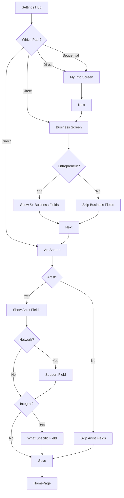

# Settings Workflow (3-Step Form)

## Overview

This diagram details the sequential multi-step form workflow within the Settings tab. Users progress through Personal Info → Business Info → Art Info before returning to the home page. Each form has conditional fields based on user responses.

## Complete Workflow Diagram

```mermaid
stateDiagram-v2
    [*] --> SettingsHub

    SettingsHub --> MyInfoScreen: Tap Personal Info
    SettingsHub --> BusinessScreen: Tap Business Info
    SettingsHub --> ArtScreen: Tap Art Info

    state MyInfoScreen {
        [*] --> FillBasicInfo
        FillBasicInfo --> UploadProfilePic
        UploadProfilePic --> EnterLocation
        EnterLocation --> SetPreferences
        SetPreferences --> ValidateMyInfo
        ValidateMyInfo --> SaveMyInfo: Valid
        ValidateMyInfo --> ShowMyInfoErrors: Invalid
        ShowMyInfoErrors --> FillBasicInfo
        SaveMyInfo --> [*]
    }

    MyInfoScreen --> BusinessScreen: Tap Next

    state BusinessScreen {
        [*] --> SelectEntrepreneur
        SelectEntrepreneur --> YesEntrepreneur: Yes
        SelectEntrepreneur --> NoEntrepreneur: No

        state YesEntrepreneur {
            [*] --> EnterCompanyName
            EnterCompanyName --> EnterIndustry
            EnterIndustry --> EnterObjectives
            EnterObjectives --> EnterMetrics
            EnterMetrics --> ValidateBusiness
            ValidateBusiness --> SaveBusiness: Valid
            ValidateBusiness --> ShowBusinessErrors: Invalid
            ShowBusinessErrors --> EnterCompanyName
            SaveBusiness --> [*]
        }

        state NoEntrepreneur {
            [*] --> SaveBusinessSkipped
            SaveBusinessSkipped --> [*]
        }
    }

    BusinessScreen --> ArtScreen: Tap Next

    state ArtScreen {
        [*] --> SelectArtist
        SelectArtist --> YesArtist: Yes
        SelectArtist --> NoArtist: No

        state YesArtist {
            [*] --> SelectProfessional
            SelectProfessional --> EnterPurpose
            EnterPurpose --> EnterFavorites
            EnterFavorites --> EnterIssues
            EnterIssues --> EnterInspiration
            EnterInspiration --> EnterStyleEvolution
            EnterStyleEvolution --> EnterCritics
            EnterCritics --> EnterNavigation
            EnterNavigation --> SelectNetwork

            SelectNetwork --> YesNetwork: Yes
            SelectNetwork --> NoNetwork: No

            YesNetwork --> EnterSupport
            NoNetwork --> SelectIntegral
            EnterSupport --> SelectIntegral

            SelectIntegral --> YesIntegral: Yes
            SelectIntegral --> NoIntegral: No

            YesIntegral --> EnterWhatIntegral
            NoIntegral --> ValidateArt
            EnterWhatIntegral --> ValidateArt

            ValidateArt --> SaveArt: Valid
            ValidateArt --> ShowArtErrors: Invalid
            ShowArtErrors --> SelectProfessional
            SaveArt --> [*]
        }

        state NoArtist {
            [*] --> SaveArtSkipped
            SaveArtSkipped --> [*]
        }
    }

    ArtScreen --> HomePage: Tap Save
    HomePage --> [*]
```



## Step-by-Step Breakdown

### Step 1: Personal Information (MyInfoScreen)

**Required Fields**:
- First Name
- Last Name
- Date of Birth (Millennials 1981-1997)

**Optional Fields**:
- Profile Picture
- City, State, Country
- Preferences (Likes, Comments, Shares toggles)

**Validation**: First name, last name, DOB required
**Next Action**: Navigate to BusinessScreen

**User Journey**:
```
1. Fill basic info (name, DOB)
2. (Optional) Upload profile picture
3. (Optional) Enter location
4. (Optional) Set preferences
5. Tap Next → BusinessScreen
```

---

### Step 2: Business Information (BusinessScreen)

**Primary Question**: Are you an entrepreneur?

**If Yes**:
- Company Name (required)
- Industry (required)
- Business Objectives (optional)
- Years in Business (optional)
- Number of Employees (optional)

**If No**:
- Skip all business fields

**Validation**: If entrepreneur, company name and industry required
**Next Action**: Navigate to ArtScreen

**User Journey (Entrepreneur)**:
```
1. Select "Yes" for entrepreneur
2. Fill company name and industry
3. (Optional) Fill objectives, years, employees
4. Tap Next → ArtScreen
```

**User Journey (Non-Entrepreneur)**:
```
1. Select "No" for entrepreneur
2. Tap Next → ArtScreen (skip all fields)
```

---

### Step 3: Artistry Information (ArtScreen)

**Primary Question**: Are you an artist?

**If Yes** (14+ conditional fields):
- Professional Artist? (Yes/No)
- Purpose of work (optional)
- Favorite/least favorite parts (optional)
- Societal issues impact (optional)
- Inspiration sources (optional)
- Style evolution (optional)
- Critics' feedback (optional)
- Industry navigation (optional)
- **Artist Network?** (Yes/No)
  - If Yes: How they support you (optional)
- **Specific Integral?** (Yes/No)
  - If Yes: What is it? (optional)

**If No**:
- Skip all art fields

**Validation**: All fields optional
**Next Action**: Navigate to HomePage

**User Journey (Artist with Network & Integral)**:
```
1. Select "Yes" for artist
2. (Optional) Fill professional status
3. (Optional) Fill purpose, favorites, issues, etc.
4. Select "Yes" for network → Fill support details
5. Select "Yes" for integral → Fill what specific
6. Tap Save → HomePage
```

**User Journey (Non-Artist)**:
```
1. Select "No" for artist
2. Tap Save → HomePage (skip all fields)
```

## Conditional Logic Summary



## Workflow Entry Points

Users can enter the workflow in three ways:

1. **Sequential** (Recommended First-Time):
   - Settings Hub → Personal Info → Next → Business Info → Next → Art Info → Save → Home
   - **Duration**: 5-10 minutes
   - **Completion**: Full profile setup

2. **Direct to Specific Form** (Update):
   - Settings Hub → Business Info → Update → Save → Home
   - **Duration**: 1-2 minutes
   - **Completion**: Partial update

3. **Random Order** (Advanced):
   - Settings Hub → Art Info → Save → Business Info → Save → Personal Info → Save
   - **Duration**: Variable
   - **Completion**: Full profile (unordered)

## Data Persistence

| Screen | API Call | MongoDB Collection | Required | Optional |
|--------|----------|-------------------|----------|----------|
| My Info | `userProfileService.updatePersonalInfo()` | `profiles.personalInfo` | firstName, lastName, DOB | city, state, country, preferences |
| Business | `userProfileService.updateBusiness()` | `profiles.business` | companyName, industry (if entrepreneur) | objectives, years, employees |
| Art | `userProfileService.updateArt()` | `profiles.art` | None (all optional) | All 14 fields |

**Data Model**: User profile stored as single MongoDB document with nested objects:
```json
{
  "userId": "firebase-uid",
  "personalInfo": { ... },
  "business": { ... },
  "art": { ... }
}
```

## User Experience Insights

### Completion Rates (Expected)
- **My Info**: ~90% (required fields, early in workflow)
- **Business**: ~60% (conditional, middle of workflow)
- **Art**: ~40% (conditional, end of workflow, many fields)

### Drop-off Points
1. **Between My Info → Business**: Users may exit after basic profile
2. **Within Art Screen**: 14 fields may cause fatigue
3. **Entrepreneur/Artist "No"**: Large field reduction, faster completion

### Time Investment
- **Minimal Path** (No entrepreneur, No artist): ~3 minutes
- **Average Path** (One conditional): ~5-7 minutes
- **Maximum Path** (Both conditionals): ~10-15 minutes

## Business Value

### Profile Completeness
- **Targeting**: Complete profiles enable better content recommendations
- **Networking**: Business/art info enables user connections (future social features)
- **Insights**: Demographic data for content strategy

### Form Design Rationale
1. **Sequential Flow**: Guides users through logical progression
2. **Conditional Fields**: Reduces cognitive load for non-applicable users
3. **Optional Fields**: Lowers barrier to completion
4. **Profile Picture**: Visual identity establishment

## Related Documentation

- [Settings Hub Wireframe](../wireframes/03-settings-tab/settings-hub.md)
- [My Info Screen Wireframe](../wireframes/03-settings-tab/my-info-screen.md)
- [Business Screen Wireframe](../wireframes/03-settings-tab/business-screen.md)
- [Art Screen Wireframe](../wireframes/03-settings-tab/art-screen.md)

---

*User journey documented as of 2026-01-30*
