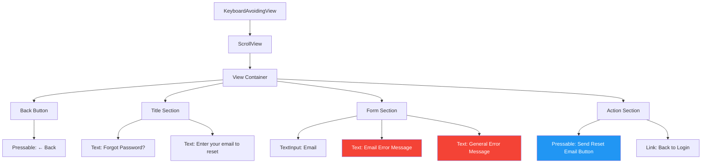
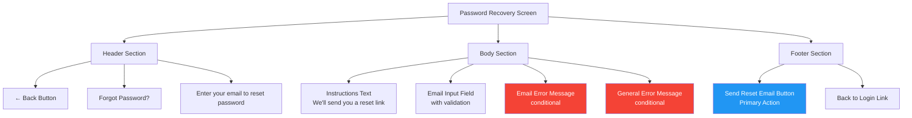
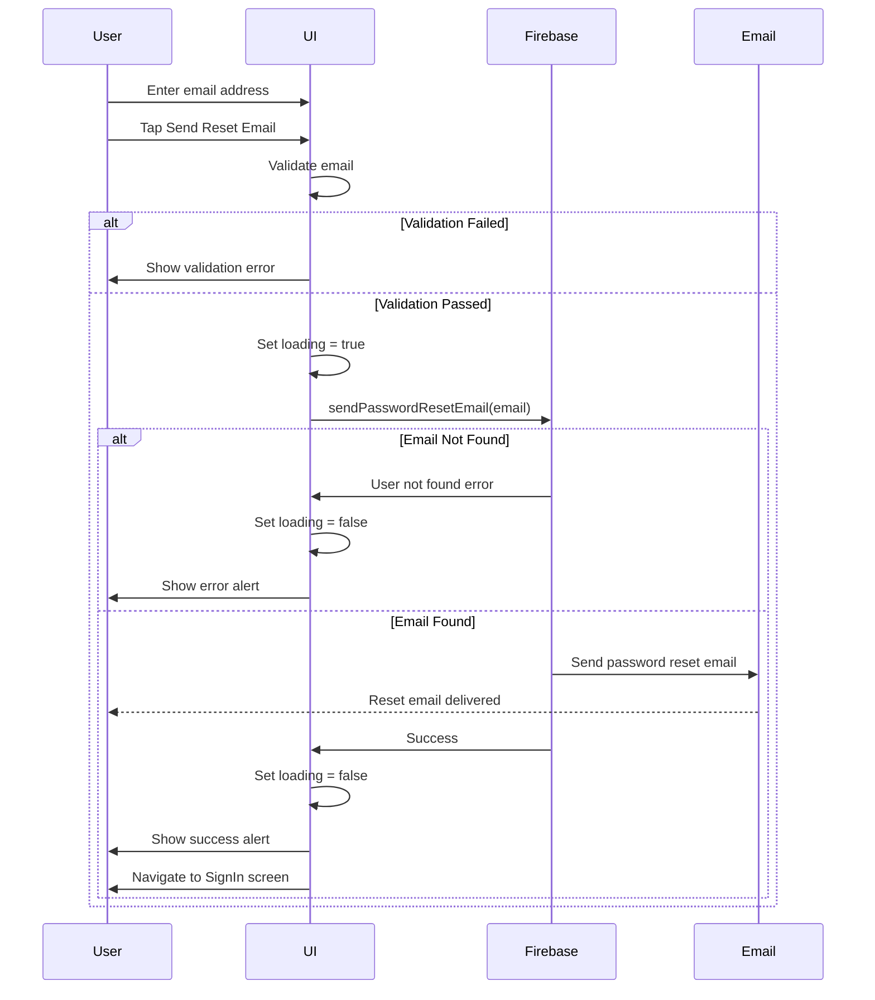
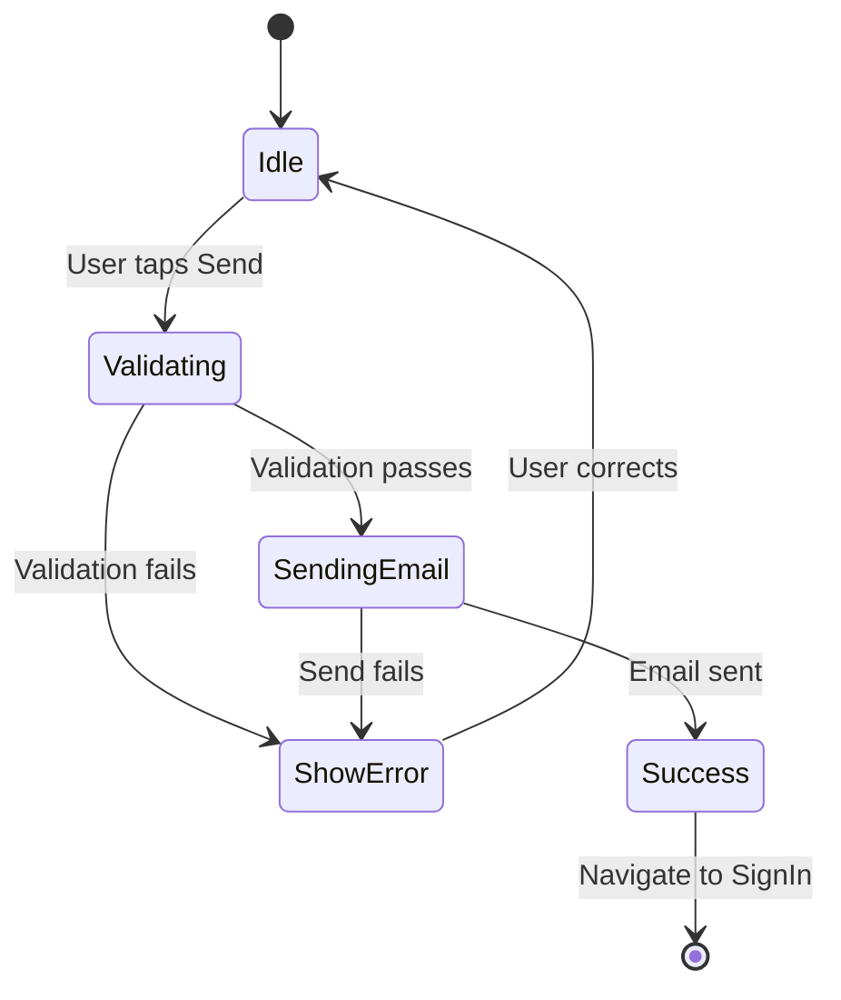
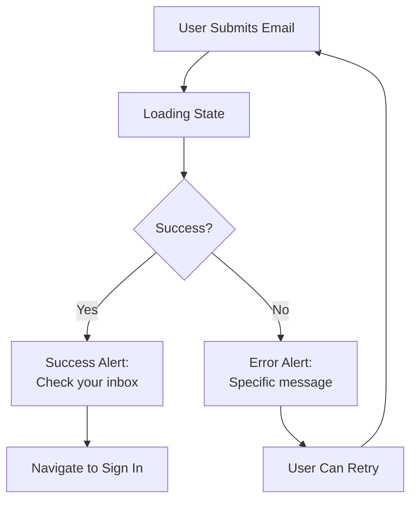

# Password Recovery Screen

**Path:** `app/(auth)/PasswordRecoveryScreen.tsx`
**Route:** `/(auth)/PasswordRecoveryScreen`
**Status:** Active
**Parent Layout:** Auth Stack Navigator

## Overview

The Password Recovery Screen allows users to reset their forgotten passwords by sending a password reset email via Firebase Authentication. Features include email validation, Firebase password reset integration, and user feedback via alerts.

## Component Hierarchy



## UI Layout



## Components Used

**React Native Core:**
- `KeyboardAvoidingView` - Keyboard layout adjustment
- `ScrollView` - Scrollable content
- `View` - Container components
- `Text` - Text display
- `TextInput` - Email input
- `Pressable` (x2) - Back button, Send button
- `Platform` - Platform-specific behavior
- `Alert` - Success/error notifications
- `ActivityIndicator` - Loading state
- `useColorScheme` - Theme detection

**Expo Router:**
- `Link` - Navigation to sign in
- `useRouter` - Imperative navigation after success

**Firebase:**
- `auth().sendPasswordResetEmail()` - Firebase password reset

**Utilities:**
- `errorHandler` - Firebase error message parsing
- `isValidEmail` - Email validation function

## Key Features

1. **Firebase Password Reset**: Uses Firebase's built-in password reset email
2. **Email Validation**: Real-time validation on blur
3. **User Feedback**: Success and error alerts
4. **Auto-Navigation**: Returns to sign in after successful email send
5. **Error Handling**: Specific error messages for different failure scenarios
6. **Loading States**: Disabled button with ActivityIndicator during send

## User Interactions

| Element | Action | Navigation Target | Method |
|---------|--------|-------------------|--------|
| Back Button | onPress → router.back() | Previous screen | Imperative |
| Email Input | onBlur → validateEmail() | - | Validation |
| Send Email Button | onPress → handlePasswordReset() | `/(auth)/SignInScreen` | On success |
| Back to Login Link | onPress | `/(auth)/SignInScreen` | Link (replace) |

## State Management

**Local State:**
```typescript
- email: string                    // Email input value
- loading: boolean                 // Loading state during email send
- emailError: string | null        // Email validation error
- errMsg: string                   // General error message
```

## Validation Rules

### Email Validation
- **Trigger**: onBlur
- **Rules**:
  1. Not empty → "Email is required."
  2. Valid email format → "Please enter a valid email address."
- **Function**: `isValidEmail(email)`

```typescript
const isValidEmail = (email: string): boolean => {
  const emailRegex = /^[^\s@]+@[^\s@]+\.[^\s@]+$/;
  return emailRegex.test(email);
};
```

### Form Submission Validation
- Email field must not be empty
- Email must pass format validation
- Both checks performed before Firebase call

## Password Reset Flow



## Firebase Integration

### Method Used
```typescript
await auth().sendPasswordResetEmail(email);
```

### Firebase Behavior
- Sends email with password reset link
- Link expires after 1 hour (Firebase default)
- Email template customizable in Firebase Console
- Multiple reset requests allowed

### Email Content (Firebase Default)
- Subject: "Reset your password for [App Name]"
- Body: Link to Firebase-hosted password reset page
- User clicks link → enters new password → password updated

## Error Handling

### Firebase Errors

| Error Code | User Message | Meaning |
|------------|--------------|---------|
| `auth/invalid-email` | "Invalid email format" | Email format incorrect |
| `auth/user-not-found` | "No account found with this email" | Email not registered |
| `auth/too-many-requests` | "Too many attempts, try again later" | Rate limit exceeded |
| `auth/network-request-failed` | "Network error, check connection" | No internet |

### Validation Errors
- Empty email → "Email is required."
- Invalid format → "Please enter a valid email address."

### Success Message
- Alert: "Password reset email sent! Check your inbox."
- Auto-navigation to sign in screen after dismissing alert

## Visual Design

### Typography
- **Title**: "Forgot Password?" - Large, bold
- **Subtitle**: "Enter your email to reset password" - Regular
- **Instructions**: Helper text explaining the process
- **Error Messages**: Small, red text

### Colors (Theme-aware)
- **Background**: `colors.background`
- **Text**: `colors.text`
- **Input Border**: `colors.border`
- **Error Text**: Red (#f44336)
- **Send Button**: Blue (secondary action color)

### Layout
- **Centered Content**: Vertically centered when keyboard hidden
- **Keyboard Avoidance**: Adjusts for keyboard
- **Single Input**: Email field is the only form input
- **Clear Call-to-Action**: Prominent send button

## Loading States

### During Email Send



**UI Changes:**
- Send button shows `<ActivityIndicator />`
- Button disabled to prevent multiple sends
- Input disabled during send operation

## Navigation Behavior

### Entry Points
1. Sign In screen "Forgot Password" link
2. Direct navigation via deep link (if configured)

### Exit Points
1. **Success**: Navigate to `/(auth)/SignInScreen` with success alert
2. **Back Button**: Return to previous screen (usually Sign In)
3. **Back to Login Link**: Navigate to `/(auth)/SignInScreen` (replace)

### User Flow After Reset

```mermaid
flowchart LR
    Recovery[Password Recovery] -->|Enter Email| Send[Send Reset Email]
    Send -->|Success| SignIn[Sign In Screen]
    SignIn --> Email[Check Email Inbox]
    Email --> ResetLink[Click Reset Link]
    ResetLink --> NewPassword[Enter New Password]
    NewPassword --> Updated[Password Updated]
    Updated --> SignIn2[Sign In with New Password]
```



## Security Considerations

1. **No Account Enumeration**:
   - Should not reveal if email exists in system
   - Production: Use generic "If account exists, email sent" message
   - Current implementation shows specific errors (dev mode)

2. **Rate Limiting**:
   - Firebase enforces rate limits
   - Prevents abuse/spam

3. **Email Verification**:
   - Reset link expires after 1 hour
   - One-time use token
   - Secure Firebase-hosted reset page

4. **No Password Display**:
   - Reset process never shows old password
   - User creates new password via secure link

## Accessibility

**Current Implementation:**
- TextInput placeholder
- Button labels

**Potential Improvements:**
- `accessibilityLabel` for input
- `accessibilityHint` for send button
- Screen reader support for success/error messages
- Auto-focus on email input

## Implementation Notes

### File Reference
[app/(auth)/PasswordRecoveryScreen.tsx](../../../app/(auth)/PasswordRecoveryScreen.tsx)

### Key Dependencies
- `@react-native-firebase/auth` - Firebase password reset
- `errorHandler` utility - Error message parsing
- `isValidEmail` utility - Email validation

### Firebase Configuration
- Password reset email template in Firebase Console
- Email sender: `noreply@[project-id].firebaseapp.com`
- Customizable branding and messaging

### Navigation After Success
```typescript
Alert.alert(
  'Success',
  'Password reset email sent! Check your inbox.',
  [
    {
      text: 'OK',
      onPress: () => router.replace('/(auth)/SignInScreen')
    }
  ]
);
```

## User Experience Considerations

### Clear Instructions
- Explains what will happen when user submits
- Sets expectation: "Check your inbox"
- Provides fallback: "Back to Login" link

### Feedback Loop


### Error Recovery
- Clear error messages guide user to fix issues
- Retry option always available
- Alternative: Return to sign in if they remember password

## Related Screens

**Previous Screens:**
- [Sign In Screen](./signin-screen.md) - "Forgot Password" link

**Next Screens:**
- [Sign In Screen](./signin-screen.md) - After successful email send

**Parent Layout:**
- Auth Stack Layout (`app/(auth)/_layout.tsx`)

## Future Enhancements

### Potential Improvements
1. **In-App Password Reset**: Custom UI instead of Firebase-hosted page
2. **SMS Reset Option**: Phone number recovery method
3. **Security Questions**: Additional verification method
4. **Account Recovery**: If email no longer accessible
5. **Multi-Factor Authentication**: Enhanced security option

### Analytics Tracking
- Track password reset requests
- Monitor success/failure rates
- Identify common error patterns

---

*This wireframe documents the current implementation as of 2026-01-30.*
