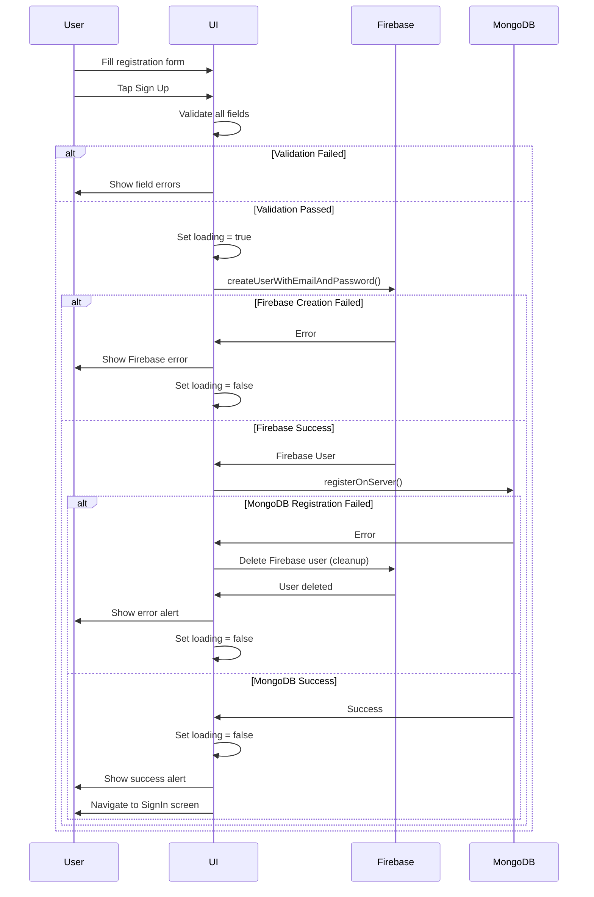
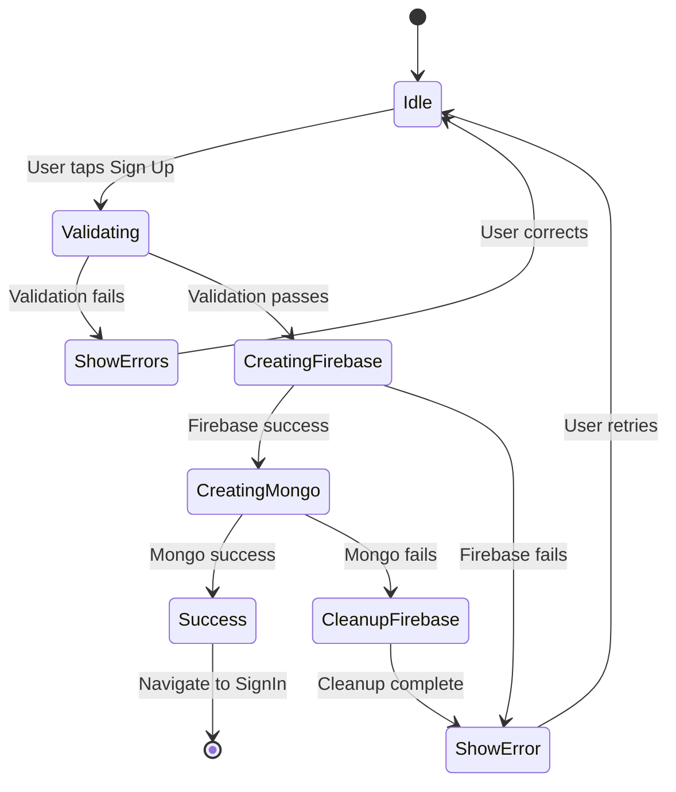

# Register Screen

**Path:** `app/(auth)/RegisterScreen.tsx`
**Route:** `/(auth)/RegisterScreen`
**Status:** Active
**Parent Layout:** Auth Stack Navigator

## Overview

The Register Screen enables new users to create an account with email/password authentication. Features include Millennials generation validation (1981-1997), dual authentication setup (Firebase + MongoDB), real-time form validation, and date picker for birth date selection.

## Component Hierarchy

```mermaid
graph TD
    A[KeyboardAvoidingView] --> B[ScrollView]
    B --> C[View Container]

    C --> D[Back Button]
    C --> E[Title Section]
    C --> F[Form Section]
    C --> G[Action Section]

    D --> D1[Pressable: ← Back]

    E --> E1[Text: Create your account]
    E --> E2[Text: Fill your information below]

    F --> F1[TextInput: First Name]
    F --> F2[Text: First Name Error]
    F --> F3[TextInput: Last Name]
    F --> F4[Text: Last Name Error]
    F --> F5[TextInput: Email]
    F --> F6[Text: Email Error]
    F --> F7[TextInput: Password]
    F --> F8[Text: Password Error]
    F --> F9[TextInput: Confirm Password]
    F --> F10[Text: Confirm Password Error]
    F --> F11[Pressable: Birth Date Picker Trigger]
    F --> F12[DateTimePicker: Birth Date]
    F --> F13[Text: DOB Error]

    G --> G1[Pressable: Sign Up Button]
    G --> G2[Link: Login Button]

    style F2 fill:#f44336,color:#fff
    style F4 fill:#f44336,color:#fff
    style F6 fill:#f44336,color:#fff
    style F8 fill:#f44336,color:#fff
    style F10 fill:#f44336,color:#fff
    style F13 fill:#f44336,color:#fff
    style G1 fill:#4CAF50,color:#fff
```



## UI Layout

```mermaid
flowchart TD
    Screen[Register Screen] --> Header[Header Section]
    Screen --> Body[Body Section]
    Screen --> Footer[Footer Section]

    Header --> BackBtn["← Back Button"]
    Header --> Title[Create your account]
    Header --> Subtitle[Fill your information below]

    Body --> FirstName[First Name Input<br/>with validation]
    Body --> FirstNameErr[First Name Error<br/>conditional]
    Body --> LastName[Last Name Input<br/>with validation]
    Body --> LastNameErr[Last Name Error<br/>conditional]
    Body --> Email[Email Input<br/>with validation]
    Body --> EmailErr[Email Error<br/>conditional]
    Body --> Password[Password Input<br/>secure entry]
    Body --> PasswordErr[Password Error<br/>conditional]
    Body --> ConfirmPassword[Confirm Password Input<br/>secure entry]
    Body --> ConfirmPasswordErr[Confirm Password Error<br/>conditional]
    Body --> DOB[Birth Date Picker<br/>Millennials 1981-1997]
    Body --> DOBErr[DOB Error<br/>conditional]

    Footer --> SignUpBtn[Sign Up Button<br/>Primary Action]
    Footer --> LoginLink[Already have account? Login]

    style FirstNameErr fill:#f44336,color:#fff
    style LastNameErr fill:#f44336,color:#fff
    style EmailErr fill:#f44336,color:#fff
    style PasswordErr fill:#f44336,color:#fff
    style ConfirmPasswordErr fill:#f44336,color:#fff
    style DOBErr fill:#f44336,color:#fff
    style SignUpBtn fill:#4CAF50,color:#fff
```



## Components Used

**React Native Core:**
- `KeyboardAvoidingView` - Keyboard layout adjustment
- `ScrollView` - Scrollable form
- `View` - Container components
- `Text` - Text display and labels
- `TextInput` (x5) - Form inputs
- `Pressable` (x3) - Back button, Sign up button, DOB picker trigger
- `Platform` - Platform-specific behavior
- `Alert` - Success/error alerts
- `ActivityIndicator` - Loading state

**External Libraries:**
- `@react-native-community/datetimepicker` - Birth date picker

**Expo Router:**
- `Link` - Navigation to login
- `useRouter` - Imperative navigation

**Firebase:**
- `auth().createUserWithEmailAndPassword()` - User registration

**Services:**
- `serverAuth.registerOnServer()` - MongoDB registration

**Utilities:**
- `errorHandler` - Firebase error parsing
- `isValidEmail` - Email validation

## Key Features

1. **Millennials Age Gate**: Only allows users born 1981-1997
2. **Dual Registration**:
   - Firebase user creation (step 1)
   - MongoDB profile creation (step 2)
   - Cleanup: Deletes Firebase user if MongoDB fails
3. **Real-Time Validation**: On blur for all fields
4. **Date Picker**: Native date picker for birth date
5. **Password Confirmation**: Matches password fields
6. **Error Handling**: Field-specific and general error messages
7. **Loading States**: Disabled button with ActivityIndicator

## User Interactions

| Element | Action | Navigation Target | Method |
|---------|--------|-------------------|--------|
| Back Button | onPress → router.back() | Previous screen | Imperative |
| First Name Input | onBlur → validateField() | - | Validation |
| Last Name Input | onBlur → validateField() | - | Validation |
| Email Input | onBlur → validateField() | - | Validation |
| Password Input | onBlur → validateField() | - | Validation |
| Confirm Password | onBlur → validateField() | - | Validation |
| DOB Picker | onChange → setDateOfBirth() | - | State update |
| Sign Up Button | onPress → handleRegister() | `/(auth)/SignInScreen` | On success |
| Login Link | onPress | `/(auth)/SignInScreen` | Link (replace) |

## State Management

**Local State:**
```typescript
- firstName: string                // First name input
- lastName: string                 // Last name input
- email: string                    // Email input
- password: string                 // Password input
- confirmPassword: string          // Password confirmation
- dateOfBirth: Date                // Birth date (default: 1990-01-01)
- loading: boolean                 // Registration in progress
- showDatePicker: boolean          // Date picker visibility

// Error states
- firstNameError: string | null
- lastNameError: string | null
- emailError: string | null
- passwordError: string | null
- confirmPasswordError: string | null
- dobError: string | null
```

## Validation Rules

### First Name
- **Trigger**: onBlur
- **Rule**: Not empty
- **Error**: "First name is required."

### Last Name
- **Trigger**: onBlur
- **Rule**: Not empty
- **Error**: "Last name is required."

### Email
- **Trigger**: onBlur
- **Rules**:
  1. Not empty → "Email is required."
  2. Valid format → "Please enter a valid email address."
- **Function**: `isValidEmail(email)`

### Password
- **Trigger**: onBlur
- **Rules**:
  1. Not empty → "Password is required."
  2. Minimum length (typically 6+ chars) → "Password must be at least 6 characters."
- **Security**: `secureTextEntry={true}`

### Confirm Password
- **Trigger**: onBlur
- **Rules**:
  1. Not empty → "Please confirm your password."
  2. Matches password → "Passwords do not match."

### Date of Birth
- **Trigger**: onChange and form submission
- **Rules**:
  1. Year >= 1981 AND Year <= 1997 → "You must be a Millennial (born between 1981 and 1997)."
  2. Not in future → "Date of birth cannot be in the future."

**Millennials Validation Function:**
```typescript
const isMillennial = (date: Date): boolean => {
  const year = date.getFullYear();
  return year >= 1981 && year <= 1997;
};
```

## Registration Flow



## Error Handling

### Firebase Errors
- `auth/email-already-in-use` → "This email is already registered"
- `auth/invalid-email` → "Invalid email format"
- `auth/weak-password` → "Password is too weak"
- `auth/operation-not-allowed` → "Email/password accounts are not enabled"

### MongoDB Errors
- If MongoDB registration fails, Firebase user is deleted to prevent orphaned accounts
- User must retry entire registration process
- Error alert: "Registration failed. Please try again."

### Validation Errors
- Field-specific errors shown below each input
- Prevents submission if any field is invalid
- Real-time feedback on blur events

## Visual Design

### Typography
- **Title**: "Create your account" - Large, bold
- **Subtitle**: "Fill your information below" - Regular
- **Input Labels**: Placeholders in input fields
- **Error Messages**: Small, red text below fields

### Colors (Theme-aware)
- **Background**: `colors.background`
- **Text**: `colors.text`
- **Inputs**: Border color from theme
- **Errors**: Red (#f44336)
- **Sign Up Button**: Primary green color

### Layout
- **Form Fields**: Stacked vertically with consistent spacing
- **Keyboard Avoidance**: Adjusts scroll position
- **Date Picker**: Platform-specific native picker
- **Error Placement**: Directly below corresponding field

## Loading States

### During Registration



**UI Changes:**
- Sign Up button shows `<ActivityIndicator />`
- Button disabled during loading
- Form inputs disabled to prevent changes

## Date Picker Behavior

### Platform Differences

**iOS:**
- Inline wheel picker
- Appears below trigger button
- Smooth scrolling

**Android:**
- Modal calendar picker
- Full-screen overlay
- Date selection dialog

### Default Date
- Set to 1990-01-01 (middle of Millennials range)
- Ensures valid Millennial date by default

### Date Format Display
- Shows selected date in locale-specific format
- Example: "01/15/1990" (US) or "15/01/1990" (EU)

## Navigation Behavior

### Entry Points
1. Welcome screen "Sign Up" button
2. Sign In screen "Create Account" link

### Exit Points
1. **Success**: Navigate to `/(auth)/SignInScreen` with alert
2. **Back Button**: Return to previous screen
3. **Login Link**: Navigate to `/(auth)/SignInScreen` (replace)

### Post-Registration
- User must log in after successful registration
- Credentials not auto-filled (security)
- Success alert guides user to sign in

## Security Considerations

1. **Password Security**:
   - Secure text entry for password fields
   - Password confirmation reduces typos
   - Firebase handles hashing and secure storage

2. **Data Validation**:
   - Client-side validation prevents bad data
   - Server-side validation in MongoDB
   - Age restriction enforced (Millennials only)

3. **Cleanup Logic**:
   - Prevents orphaned Firebase accounts
   - Deletes Firebase user if MongoDB fails
   - Maintains data consistency

4. **Email Verification** (Future Enhancement):
   - Currently no email verification required
   - Potential future feature for enhanced security

## Implementation Notes

### File Reference
[app/(auth)/RegisterScreen.tsx](../../../app/(auth)/RegisterScreen.tsx)

### Key Dependencies
- `@react-native-firebase/auth` - Firebase authentication
- `@react-native-community/datetimepicker` - Date picker
- `serverAuth` service - MongoDB registration
- `errorHandler` utility - Error parsing

### Validation Timing
```typescript
// Validate on blur for immediate feedback
onBlur={() => validateField('firstName')}

// Validate on submission for final check
handleRegister() {
  if (!validateAllFields()) {
    return;
  }
  // Proceed with registration
}
```

## Related Screens

**Previous Screens:**
- [Welcome Screen](./welcome-screen.md) - Initial entry point
- [Sign In Screen](./signin-screen.md) - Alternative for existing users

**Next Screens:**
- [Sign In Screen](./signin-screen.md) - Post-registration login

**Parent Layout:**
- Auth Stack Layout (`app/(auth)/_layout.tsx`)

---

*This wireframe documents the current implementation as of 2026-01-30.*
