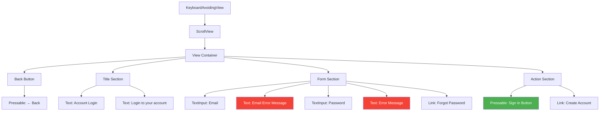
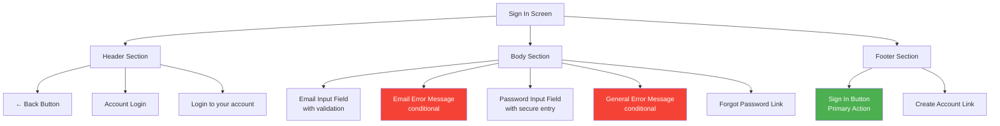
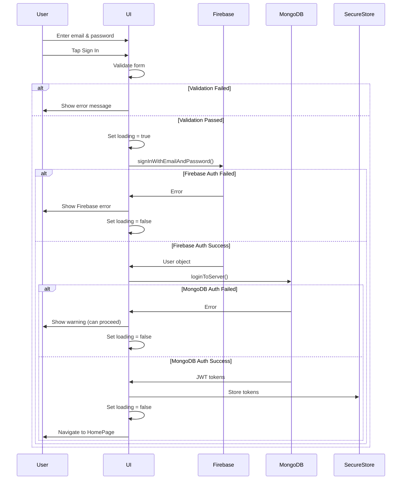
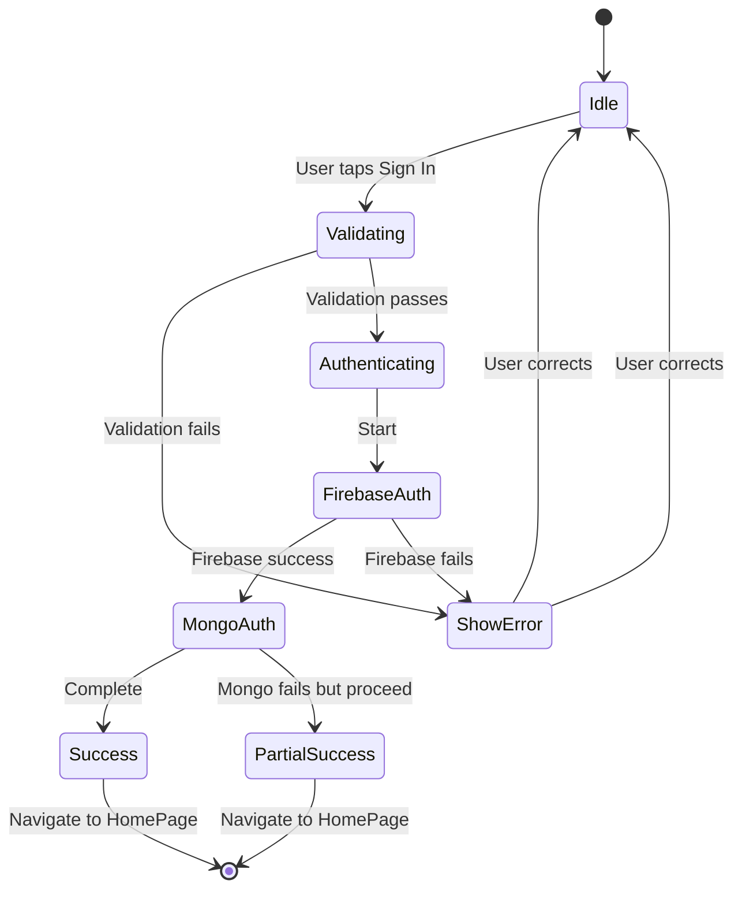

# Sign In Screen

**Path:** `app/(auth)/SignInScreen.tsx`
**Route:** `/(auth)/SignInScreen`
**Status:** Active
**Parent Layout:** Auth Stack Navigator

## Overview

The Sign In Screen allows existing users to authenticate using their email and password. It implements dual authentication (Firebase + MongoDB), real-time form validation, and provides links to registration and password recovery flows.

## Component Hierarchy



## UI Layout



## Components Used

**React Native Core:**
- `KeyboardAvoidingView` - Adjusts layout when keyboard appears
- `ScrollView` - Scrollable content
- `View` - Container components
- `Text` - Text display
- `TextInput` (x2) - Email and password inputs
- `Pressable` (x2) - Back button, Sign in button
- `Platform` - iOS/Android specific behavior
- `Alert` - Error/success messages
- `ActivityIndicator` - Loading state
- `useColorScheme` - Theme detection

**Expo Router:**
- `Link` - Navigation to register and password recovery
- `useRouter` - Imperative navigation after success

**Custom Hooks:**
- `useAuth` - Access authentication context

**Services:**
- `serverAuth` - MongoDB authentication service

**Firebase:**
- `auth().signInWithEmailAndPassword()` - Firebase authentication

**Utilities:**
- `errorHandler` - Firebase error message parsing
- `isValidEmail` - Email validation function

## Key Features

1. **Real-Time Email Validation**: Validates on blur and displays inline errors
2. **Password Security**: Secure text entry for password field
3. **Dual Authentication**:
   - Firebase authentication (primary)
   - MongoDB server authentication (secondary)
4. **Error Handling**: Displays specific error messages for auth failures
5. **Loading States**: Shows ActivityIndicator during authentication
6. **Form Validation**: Checks for empty fields before submission
7. **Navigation Links**: To registration and password recovery

## User Interactions

| Element | Action | Navigation Target | Method |
|---------|--------|-------------------|--------|
| Back Button | onPress → router.back() | Previous screen | Imperative (router.back) |
| Email Input | onBlur → validateEmail() | - | Local validation |
| Forgot Password Link | onPress | `/(auth)/PasswordRecoveryScreen` | Link (push) |
| Sign In Button | onPress → handleLogin() | `/(tabs)/(home)/HomePage` | Imperative (on success) |
| Create Account Link | onPress | `/(auth)/RegisterScreen` | Link (replace) |

## State Management

**Local State:**
```typescript
- email: string                    // Email input value
- password: string                 // Password input value
- errMsg: string                   // General error message
- loading: boolean                 // Loading state during auth
- emailError: string | null        // Email validation error
```

**Global State:**
- `user` - Auth context (from useAuth hook)

## Validation Rules

### Email Validation
- **Trigger**: onBlur (when user leaves the field)
- **Rule**: Must match email regex pattern
- **Error Message**: "Please enter a valid email address."
- **Function**: `isValidEmail(email)`

### Form Submission Validation
1. **Email Required**: "Email is required!"
2. **Password Required**: "Password is required!"
3. **Email Format**: Must pass `isValidEmail()` check

## Authentication Flow



## Error Handling

### Firebase Errors
Handled by `errorHandler()` utility:
- `auth/invalid-email` → "Invalid email format"
- `auth/user-not-found` → "No account found with this email"
- `auth/wrong-password` → "Incorrect password"
- `auth/too-many-requests` → "Too many attempts, try again later"

### MongoDB Errors
- Server authentication failures show warning but don't block app access
- User can still access app with Firebase auth only
- MongoDB provides API access tokens, not required for basic features

### Form Validation Errors
- Empty email → "Email is required!"
- Empty password → "Password is required!"
- Invalid email format → "Please enter a valid email address."

## Visual Design

### Typography
- **Title**: "Account Login" - Large, bold
- **Subtitle**: "Login to your account" - Regular
- **Input Labels**: Email, Password
- **Error Messages**: Red text, smaller font

### Colors (Theme-aware)
- **Background**: `colors.background`
- **Text**: `colors.text`
- **Input Borders**: `colors.border`
- **Error Text**: Red (#f44336 or similar)
- **Sign In Button**: Primary color (green)

### Layout
- **Keyboard Avoidance**: iOS uses padding, Android uses height adjustment
- **Scroll Support**: Ensures form visible when keyboard open
- **Input Spacing**: Generous padding between form fields
- **Error Placement**: Below respective input fields

## Loading States

### During Authentication
- **Sign In Button**: Shows ActivityIndicator instead of text
- **Button Disabled**: Prevents multiple submissions
- **State**: `loading === true`



## Navigation Behavior

### Entry Points
1. Welcome screen "Log In" button
2. Registration success (after creating account)
3. Password recovery success
4. Auth gating redirect (unauthenticated user)

### Exit Points
1. **Success**: Navigate to `/(tabs)/(home)/HomePage`
2. **Back Button**: Return to previous screen
3. **Create Account**: Navigate to `/(auth)/RegisterScreen`
4. **Forgot Password**: Navigate to `/(auth)/PasswordRecoveryScreen`

## Accessibility

**Current Implementation:**
- TextInput placeholders
- Secure text entry for password

**Potential Improvements:**
- `accessibilityLabel` for inputs
- `accessibilityHint` for buttons
- Screen reader support for error messages
- Auto-focus on email field on mount

## Security Considerations

1. **Password Security**:
   - `secureTextEntry={true}` hides password
   - Not stored in state longer than necessary
   - Cleared on unmount

2. **Error Messages**:
   - Don't reveal if email exists in system
   - Generic "invalid credentials" for production

3. **Token Storage**:
   - JWT tokens stored in `expo-secure-store`
   - Never in AsyncStorage or local state

4. **Rate Limiting**:
   - Firebase handles rate limiting
   - Too many attempts locked by Firebase

## Implementation Notes

### File Reference
[app/(auth)/SignInScreen.tsx](../../../app/(auth)/SignInScreen.tsx)

### Key Dependencies
- `@react-native-firebase/auth` - Firebase authentication
- `serverAuth` service - MongoDB authentication
- `errorHandler` utility - Error message parsing
- `isValidEmail` utility - Email validation

### Validation Functions
```typescript
const isValidEmail = (email: string): boolean => {
  const emailRegex = /^[^\s@]+@[^\s@]+\.[^\s@]+$/;
  return emailRegex.test(email);
};
```

## Related Screens

**Previous Screens:**
- [Welcome Screen](./welcome-screen.md) - Entry point

**Next Screens:**
- [Register Screen](./register-screen.md) - New account creation
- [Password Recovery Screen](./password-recovery-screen.md) - Reset password
- [HomePage](../02-home-tab/home-page.md) - Post-authentication

**Parent Layout:**
- Auth Stack Layout (`app/(auth)/_layout.tsx`)

---

*This wireframe documents the current implementation as of 2026-01-30.*
