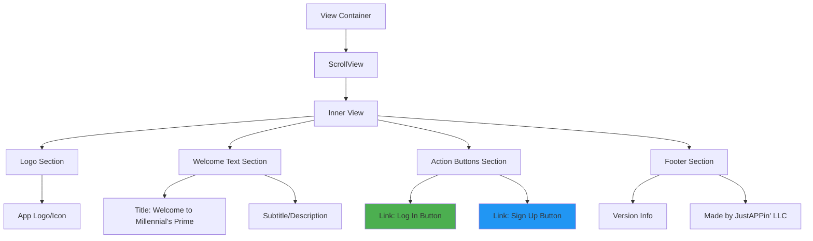
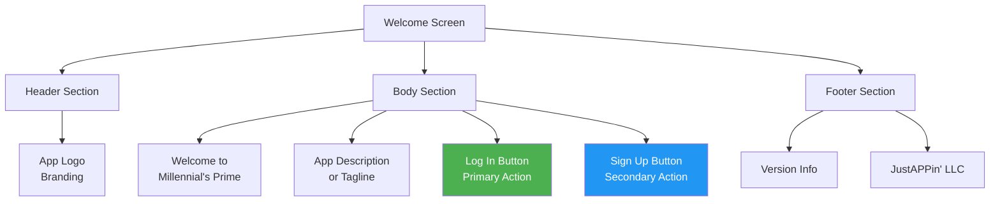
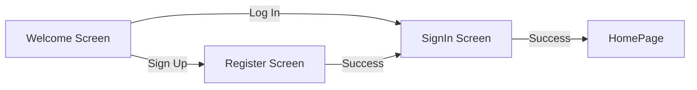

# Welcome Screen

**Path:** `app/index.tsx`
**Route:** `/`
**Status:** Active
**Parent Layout:** Root Stack Navigator

## Overview

The Welcome Screen serves as the entry point for unauthenticated users. It displays the app branding, version information, and provides navigation options to sign in or create a new account.

## Component Hierarchy



## UI Layout



## Components Used

**React Native Core:**
- `View` - Container components
- `ScrollView` - Scrollable content wrapper
- `Text` - Text display
- `useColorScheme` - Dark/light mode detection

**Expo Router:**
- `Link` - Declarative navigation component

**Custom:**
- `globalStyles` - Global style constants
- `COLORS` - Theme color scheme

## Key Features

1. **Responsive Layout**: Centers content vertically and horizontally
2. **Theme Support**: Adapts to device color scheme (dark/light mode)
3. **Navigation Links**: Declarative routing to authentication screens
4. **Branding**: Displays app identity and version info

## User Interactions

| Element | Action | Navigation Target | Method |
|---------|--------|-------------------|--------|
| "Log In" Button | onPress | `/(auth)/SignInScreen` | Link (replace) |
| "Sign Up" Button | onPress | `/(auth)/RegisterScreen` | Link (replace) |

## State Management

**No Local State** - This is a stateless presentation component.

**Global State Used:**
- `colorScheme` - Device theme (dark/light)
- `colors` - Theme-based color palette

## Visual Design

### Typography
- **Title**: Large, bold - "Welcome to Millennial's Prime"
- **Version**: Small text showing app version
- **Footer**: Company attribution text

### Colors (Dynamic)
- **Background**: `colors.background` (theme-aware)
- **Text**: `colors.text` (theme-aware)
- **Login Button**: Primary color (usually green)
- **Sign Up Button**: Secondary color (usually blue)

### Layout
- **Alignment**: Centered (both horizontal and vertical)
- **Spacing**: Generous padding between elements
- **Scroll**: Enabled for smaller screens or landscape orientation

## Navigation Behavior

### Entry Point
- First screen shown to unauthenticated users
- Auth gating in root layout redirects here if no user logged in

### Exit Points


### Link Configuration

**Log In Link:**
```tsx
<Link href="/(auth)/SignInScreen" replace asChild>
  <Pressable>
    <Text>Log In</Text>
  </Pressable>
</Link>
```
- Uses `replace` to prevent back navigation to welcome screen
- `asChild` applies Link behavior to child Pressable

**Sign Up Link:**
```tsx
<Link href="/(auth)/RegisterScreen" replace asChild>
  <Pressable>
    <Text>Sign Up</Text>
  </Pressable>
</Link>
```
- Uses `replace` for same reason
- Maintains consistent navigation pattern

## Screen States

### Default State
- Logo visible
- Welcome text displayed
- Both action buttons visible
- Footer with version info

### No Additional States
- No loading states (stateless component)
- No error states (no data fetching)
- No conditional rendering based on user input

## Accessibility

**Potential Improvements:**
- Add `accessibilityLabel` to buttons
- Add `accessibilityHint` for navigation actions
- Ensure sufficient color contrast for text
- Support for screen readers

## Implementation Notes

### File Reference
[app/index.tsx](../../../app/index.tsx)

### Key Dependencies
- `expo-router` - Link component for navigation
- `globalStyles` from `@/constants/global`
- `COLORS` from `@/constants/Colors`

### Styling Approach
- Uses global style constants for consistency
- Theme-aware colors for dark/light mode support
- Responsive layout adapts to screen size

## Related Screens

**Next Screens:**
- [Sign In Screen](./signin-screen.md) - Primary user login
- [Register Screen](./register-screen.md) - New user account creation

**Parent Layout:**
- Root Layout (`app/_layout.tsx`) - Auth gating logic

---

*This wireframe documents the current implementation as of 2026-01-30.*
