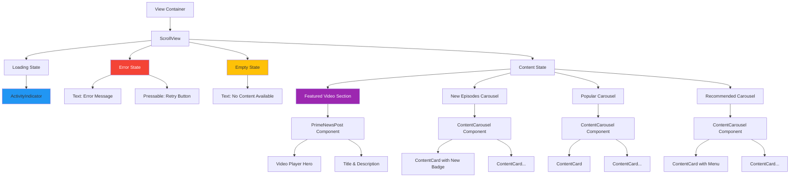
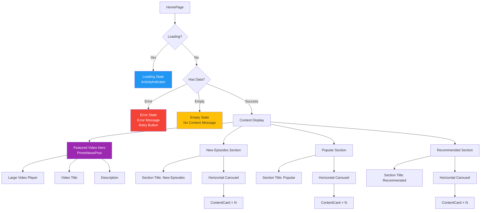
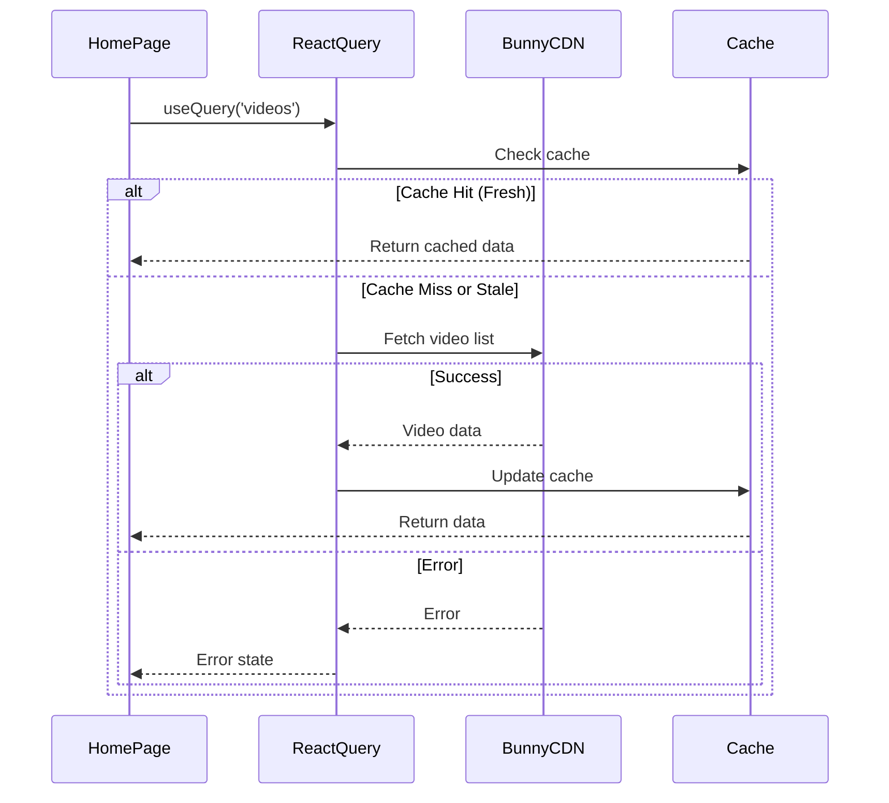
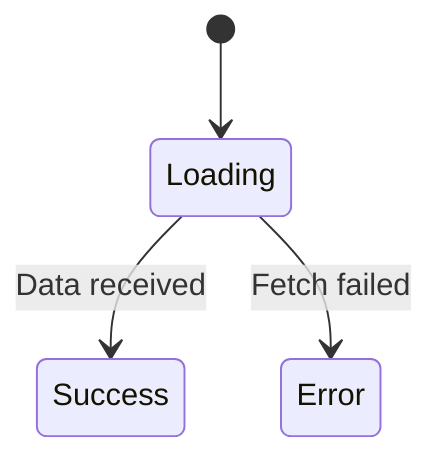
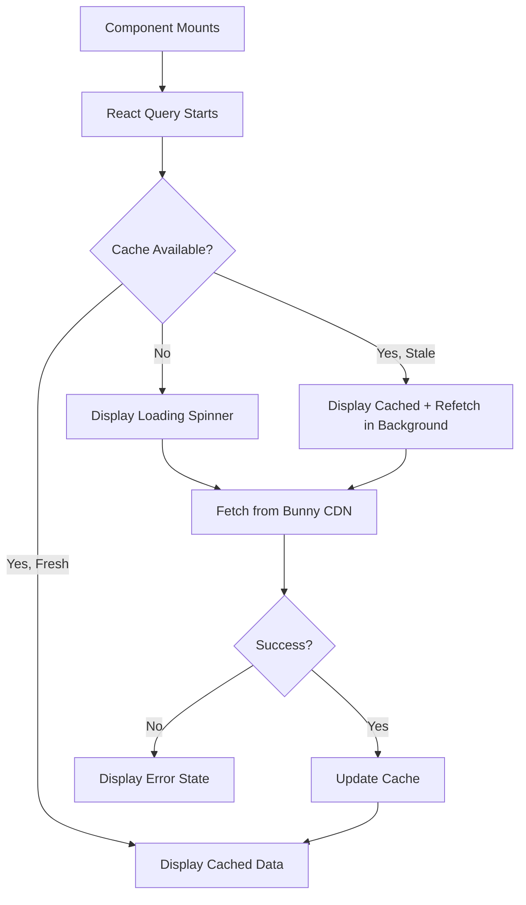

# HomePage

**Path:** `app/(tabs)/(home)/HomePage.tsx`
**Route:** `/(tabs)/(home)/HomePage`
**Status:** Active
**Parent Layout:** Home Tab Stack Navigator (nested in Tabs Navigator)

## Overview

The HomePage is the main content feed for authenticated users, featuring video content delivered via Bunny CDN. It implements an HBO-style layout with a featured video hero section followed by multiple horizontal content carousels (New Episodes, Popular, Recommended). The screen handles loading states, errors, and empty states gracefully.

## Component Hierarchy



## UI Layout



## Components Used

**React Native Core:**
- `View` - Container components
- `ScrollView` - Vertical scrolling for entire page
- `Text` - Section titles, error messages
- `ActivityIndicator` - Loading state
- `Pressable` - Retry button
- `useColorScheme` - Theme detection

**Custom Components:**
- **PrimeNewsPost** (`/shared/PostComponents/PrimeNewsPost`) - Featured video hero
- **ContentCarousel** (`/components/ContentCarousel`) - Horizontal scrolling carousel
- **ContentCard** (`/components/ContentCard`) - Individual content cards

**Data Fetching:**
- **React Query** (`useQuery`) - Data fetching and caching
- Bunny CDN API integration

**Expo Router:**
- Tab navigation (automatic)

## Key Features

1. **Video Content Feed**: Displays video content from Bunny CDN
2. **HBO-Style Layout**: Featured hero + multiple carousels
3. **Content Sections**:
   - Featured video (large hero section)
   - New Episodes (cards with "New Episode" badges)
   - Popular content
   - Recommended content
4. **Loading States**: ActivityIndicator while fetching data
5. **Error Handling**: Error message with retry button
6. **Empty State**: Message when no content available
7. **Responsive Carousels**: Horizontal scroll with multiple cards
8. **Theme Support**: Dark/light mode compatibility

## Data Flow



## User Interactions

| Element | Action | Result | Navigation |
|---------|--------|--------|------------|
| Featured Video | Tap | Play video | Video player screen (future) |
| ContentCard | Tap | View details | Content detail screen (future) |
| Card Menu Button | Tap | Open menu | Bottom sheet with options |
| Retry Button | Tap | Refetch data | Reload from API |
| Scroll Down | Scroll | View more sections | - |
| Carousel Scroll | Horizontal scroll | View more cards in section | - |

## State Management

**React Query State:**
```typescript
const { data, isLoading, isError, error, refetch } = useQuery({
  queryKey: ['videos'],
  queryFn: fetchVideosFromBunny,
  staleTime: 5 * 60 * 1000, // 5 minutes
});
```

**Derived State:**
```typescript
- isLoading: boolean          // Loading spinner visible
- isError: boolean            // Error state active
- data: VideoData[] | undefined  // Video content array
- isEmpty: boolean            // No content available (data.length === 0)
```

**Local State (if any):**
```typescript
// Minimal local state - mostly relies on React Query
```

## Screen States

### 1. Loading State


**UI**:
- Centered ActivityIndicator
- No content visible

### 2. Error State
**UI**:
- Error icon or message
- Error text: "Failed to load content"
- Retry button
- No content visible

**User Action**: Tap retry → refetch data

### 3. Empty State
**UI**:
- Icon or illustration
- Message: "No content available"
- No carousels visible

### 4. Success State (Content Display)
**UI**:
- Featured video hero
- Multiple content carousels
- All sections visible
- Scrollable content

## Content Sections

### Featured Video Hero (PrimeNewsPost)

**Layout**:
- Full-width video player
- Video title overlay
- Description text
- Author info (if applicable)
- Prime badge (if applicable)

**Component Props**:
```typescript
<PrimeNewsPost
  name="Creator Name"
  title="Featured Video Title"
  description="Video description..."
  prime={true}
  admin={false}
  libraryId={147838}
  videoId="video-uuid"
  authorId="author-id"
/>
```

### New Episodes Carousel

**Section Title**: "New Episodes"

**Features**:
- Horizontal scrolling carousel
- ContentCard components with "New Episode" badge
- Shows latest content first

**ContentCard Props**:
```typescript
<ContentCard
  title="Episode Title"
  description="Episode description..."
  dateUploaded="2026-01-25"
  isPrime={true}
  showNewBadge={true}
  showMenu={false}
  onPress={() => handleCardPress(video)}
/>
```

### Popular Carousel

**Section Title**: "Popular"

**Features**:
- Most viewed or trending content
- Standard ContentCard without special badges
- Horizontal scroll

### Recommended Carousel

**Section Title**: "Recommended"

**Features**:
- Personalized recommendations (future: ML-based)
- Currently: Curated content
- ContentCard with menu options
- Horizontal scroll

**ContentCard with Menu**:
```typescript
<ContentCard
  title="Video Title"
  description="Description..."
  isPrime={false}
  showMenu={true}
  onMenuPress={() => handleMenuPress(video)}
/>
```

## Content Card Menu Options (Future)

When user taps menu on ContentCard:
1. **Share** - Share content with others
2. **Save** - Add to watch later
3. **Report** - Report inappropriate content
4. **Hide** - Hide from recommendations

## Visual Design

### Typography
- **Section Titles**: Large, bold (e.g., "New Episodes")
- **Card Titles**: Medium, bold
- **Card Descriptions**: Small, regular
- **Dates**: Extra small, low opacity

### Colors (Theme-aware)
- **Background**: `colors.background`
- **Text**: `colors.text`
- **Prime Cards**: Purple gradient (`colors.primeGradient`)
- **Regular Cards**: Blue/teal gradient (`colors.showGradient`)
- **New Badge**: Accent color (`colors.triC`)

### Layout
- **Section Spacing**: Consistent vertical padding between sections
- **Carousel Spacing**: Horizontal padding and gap between cards
- **Hero Sizing**: Full width, variable height based on video aspect ratio
- **Card Sizing**: ~70% screen width (`width * 0.7`)

## Loading & Error Behavior

### Loading Sequence


### Retry Logic
- User taps retry button
- Calls `refetch()` from React Query
- Returns to loading state
- Attempts to fetch data again

### Cache Strategy
- **Stale Time**: 5 minutes (data considered fresh for 5 mins)
- **Cache Time**: 30 minutes (data kept in cache for 30 mins)
- **Background Refetch**: Automatically refetches when window refocuses
- **Retry**: Automatic retry on failure (3 attempts)

## API Integration

### Bunny CDN API

**Endpoint**: `https://api.bunnycdn.com/videolibrary/{libraryId}/videos`

**Response Structure** (Example):
```json
{
  "items": [
    {
      "guid": "video-uuid",
      "title": "Video Title",
      "description": "Description",
      "dateUploaded": "2026-01-25T10:00:00Z",
      "views": 12345,
      "isNew": true,
      "isPrime": true
    }
  ]
}
```

**Data Transformation**:
- Maps Bunny CDN response to app's data model
- Filters content by category (new, popular, recommended)
- Sorts by date, views, or recommendation score

## Performance Optimizations

### React Query Caching
- Reduces API calls
- Instant display from cache
- Background updates

### Carousel Optimization
- Lazy loading of images in cards
- Virtual scrolling for long lists (future enhancement)
- Image optimization with Expo Image

### Video Player
- Thumbnail preview (not full video) in cards
- Full video loads only on tap

## Accessibility

**Current Implementation:**
- ScrollView with showsVerticalScrollIndicator
- Touchable cards with onPress handlers

**Potential Improvements:**
- `accessibilityLabel` for cards ("Play [Video Title]")
- `accessibilityHint` for carousels ("Swipe left or right to browse")
- Screen reader support for section titles
- Focus management for keyboard navigation

## Implementation Notes

### File Reference
[app/(tabs)/(home)/HomePage.tsx](../../../app/(tabs)/(home)/HomePage.tsx)

### Key Dependencies
- `@tanstack/react-query` - Data fetching and caching
- Bunny CDN API client
- PrimeNewsPost component
- ContentCarousel component
- ContentCard component

### Data Fetching Hook
```typescript
import { useQuery } from '@tanstack/react-query';

const { data: videos, isLoading, isError, refetch } = useQuery({
  queryKey: ['videos'],
  queryFn: fetchVideosFromBunny,
  staleTime: 5 * 60 * 1000,
});
```

## Future Enhancements

### Planned Features
1. **Infinite Scroll**: Load more content as user scrolls
2. **Pull to Refresh**: Swipe down to reload
3. **Personalized Recommendations**: ML-based content suggestions
4. **Video Playback**: In-app video player
5. **Search**: Search bar to find specific content
6. **Filters**: Filter by genre, date, popularity
7. **User Interactions**: Like, comment, share buttons
8. **Watch Progress**: Track where user left off

### Analytics
- Track video views
- Carousel engagement metrics
- Popular content identification
- User preferences learning

## Related Screens

**Parent Screens:**
- Main App Tabs - Home tab selected

**Related Components:**
- [ContentCard Component](../../components/COMPONENT_LIBRARY.md#contentcard)
- [ContentCarousel Component](../../components/COMPONENT_LIBRARY.md#contentcarousel)
- [PrimeNewsPost Component](../../components/SHARED_COMPONENTS.md#primenewspost)

**Navigation:**
- Tab navigation to Settings
- Future: Navigate to video player
- Future: Navigate to content details

---

*This wireframe documents the current implementation as of 2026-01-30.*
