# Art Screen

**Path:** `app/(tabs)/(settings)/ArtScreen.tsx`
**Route:** `/(tabs)/(settings)/ArtScreen`
**Status:** Active
**Parent Layout:** Settings Tab Stack Navigator

## Overview

The Art Screen is an extensive conditional questionnaire for artists and creative professionals. Features yes/no pickers for artist status, professional experience, and network membership, with 14+ conditional fields covering purpose of work, inspiration, style evolution, critics, industry navigation, and support networks.

## Component Hierarchy


## UI Layout

```mermaid
flowchart TD
    Screen[Art Screen] --> Header[Header]
    Screen --> Body[Form Body]
    Screen --> Footer[Actions]

    Header --> BackBtn[← Back]
    Header --> Title[Art Information]

    Body --> ArtistQ[Are you an Artist?]
    ArtistQ --> ArtistPicker[Yes/No Picker]

    ArtistPicker --> Conditional{If Yes}

    Conditional -->|Yes| ArtistFields[Artist Fields Group 1]
    Conditional -->|No| Skip[Skip to Save]

    ArtistFields --> Professional[Professional Artist? Picker]
    ArtistFields --> Purpose[Purpose of work]
    ArtistFields --> Favs[Favorite/least favorite parts]
    ArtistFields --> Issues[Societal issues impact]

    ArtistFields --> Group2[Artist Fields Group 2]
    Group2 --> Inspiration[Trends that inspire work]
    Group2 --> Style[Style evolution]
    Group2 --> Critics[What critics said]
    Group2 --> Navigation[Industry navigation]

    ArtistFields --> Group3[Artist Fields Group 3]
    Group3 --> Network[Have artist network? Picker]
    Network -->|If Yes| Support[How they support you]
    Group3 --> Integral[Anything integral? Picker]
    Integral -->|If Yes| WhatIntegral[What is it?]

    Footer --> SaveBtn[Save Changes Button]
```



## Fields & Validation

| Field | Condition | Type | Validation |
|-------|-----------|------|------------|
| Artist? | Always | Picker (Yes/No) | Required |
| **If Artist = Yes:** |
| Professional Artist? | If Artist | Picker (Yes/No) | Optional |
| Purpose of work | If Artist | TextInput (multiline) | Optional |
| Favorites/least favorites | If Artist | TextInput (multiline) | Optional |
| Societal issues impact | If Artist | TextInput (multiline) | Optional |
| Inspiration sources | If Artist | TextInput (multiline) | Optional |
| Style evolution | If Artist | TextInput (multiline) | Optional |
| Critics' feedback | If Artist | TextInput (multiline) | Optional |
| Industry navigation | If Artist | TextInput (multiline) | Optional |
| Artist network? | If Artist | Picker (Yes/No) | Optional |
| Network support | If Network=Yes | TextInput (multiline) | Optional |
| Specific integral? | If Artist | Picker (Yes/No) | Optional |
| What specific? | If Integral=Yes | TextInput (multiline) | Optional |

## State Management

```typescript
// Main picker
- artist: string ("Yes" | "No" | "")
- artistPicker: boolean

// Conditional fields (if artist)
- professional: string ("Yes" | "No" | "")
- professionalPicker: boolean
- purpose: string
- favsOrNoneFavs: string
- affectIssues: string
- inspirationOfWork: string
- styleChanged: string
- critics: string
- navigateIndustry: string

// Nested conditional (if network)
- network: string ("Yes" | "No" | "")
- networkPicker: boolean
- support: string

// Nested conditional (if integral)
- specificIntegral: string ("Yes" | "No" | "")
- specificIntegralPicker: boolean
- whatSpecfic: string

// UI state
- loading: boolean
```

## Conditional Logic Flow


## Form Submission Flow


## Visual Design

- **Grouped Fields**: Three visual groups for better organization
- **Multiline Inputs**: Text areas for detailed responses
- **Pickers**: Native picker UI for Yes/No questions
- **Conditional Animation**: Smooth show/hide for conditional fields
- **Scroll Support**: Long form with proper scroll behavior
- **Theme Support**: Dark/light mode compatible

## Implementation Notes

**File Reference**: [app/(tabs)/(settings)/ArtScreen.tsx](../../../app/(tabs)/(settings)/ArtScreen.tsx)

**Key Dependencies**:
- Picker (@react-native-picker/picker)
- userProfileService.updateArt()
- useUserProfile hook

**Conditional Rendering Pattern**:
```typescript
{artist === "Yes" && (
  <View>
    {/* Artist fields */}
    {network === "Yes" && (
      <View>{/* Support field */}</View>
    )}
    {specificIntegral === "Yes" && (
      <View>{/* What specific field */}</View>
    )}
  </View>
)}
```

**Data Persistence**:
- Saves to MongoDB `profile.art` collection
- All fields optional (users can skip if not artists)

**Navigation**: `router.push("/(tabs)/(home)/HomePage")` on success

**Success Feedback**: Alert: "Your art information has been updated!"

## Related Screens

- **Previous**: [Business Screen](./business-screen.md)
- **Next**: [HomePage](../02-home-tab/home-page.md) (completes settings workflow)

---

*Wireframe as of 2026-01-30*
