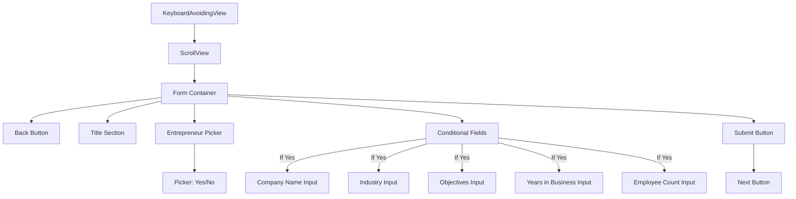
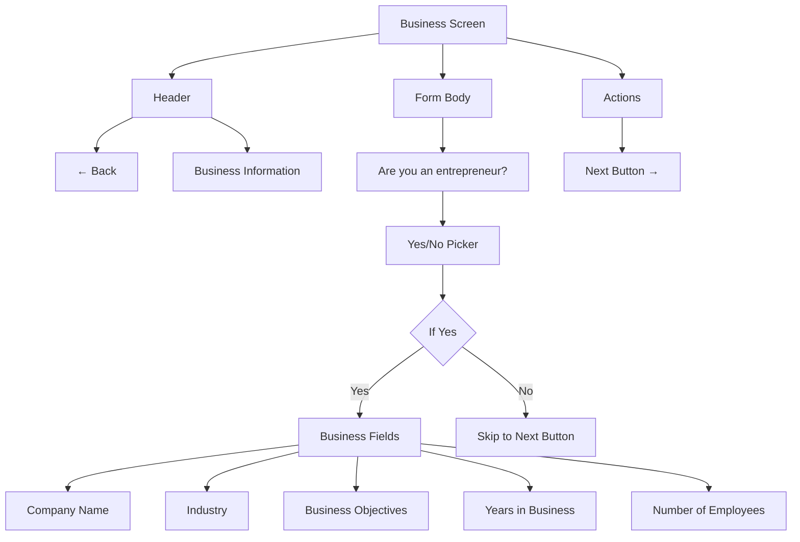
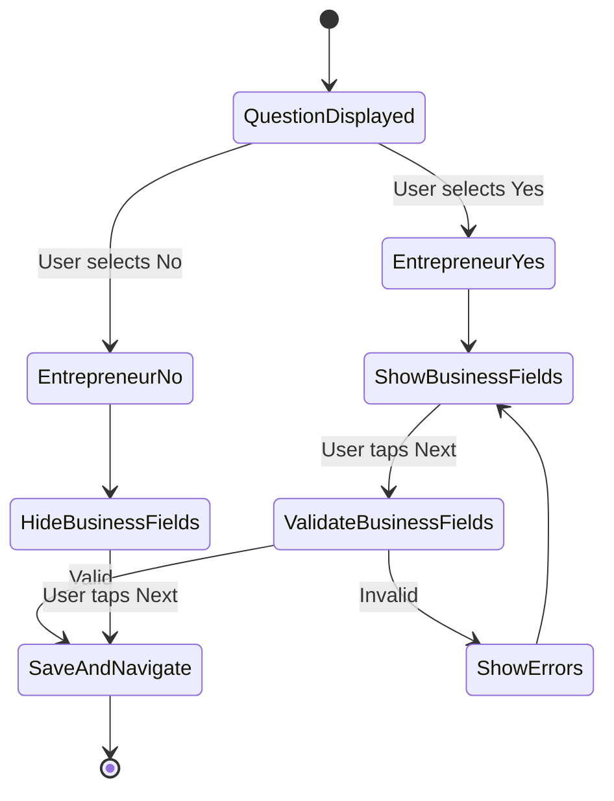
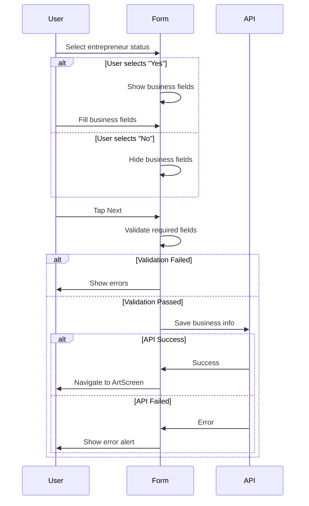

# Business Screen

**Path:** `app/(tabs)/(settings)/BusinessScreen.tsx`
**Route:** `/(tabs)/(settings)/BusinessScreen`
**Status:** Active
**Parent Layout:** Settings Tab Stack Navigator

## Overview

The Business Screen is a conditional questionnaire that collects business-related information from entrepreneurs. Features a yes/no picker for entrepreneur status, followed by conditional fields for company info, industry, business objectives, and metrics if user is an entrepreneur.

## Component Hierarchy



## UI Layout



## Fields & Validation

| Field | Condition | Type | Validation |
|-------|-----------|------|------------|
| Entrepreneur? | Always | Picker (Yes/No) | Required |
| Company Name | If Yes | TextInput | Required if entrepreneur |
| Industry | If Yes | TextInput | Required if entrepreneur |
| Objectives | If Yes | TextInput (multiline) | Optional |
| Years in Business | If Yes | Number Input | Optional |
| Employee Count | If Yes | Number Input | Optional |

## State Management

```typescript
// Main field
- isEntrepreneur: string ("Yes" | "No" | "")
- showEntrepreneurPicker: boolean

// Conditional fields (only if entrepreneur)
- companyName: string
- industry: string
- objectives: string
- yearsInBusiness: string
- employeeCount: string

// UI state
- loading: boolean
- errors: Record<string, string>
```

## Conditional Logic



## Form Submission Flow



## Visual Design

- **Picker Section**: Centered picker for entrepreneur question
- **Conditional Fields**: Slide in/fade in when "Yes" selected
- **Text Areas**: Multiline input for objectives
- **Number Inputs**: Numeric keyboard for years/employees
- **Theme Support**: Dark/light mode compatible

## Implementation Notes

**File Reference**: [app/(tabs)/(settings)/BusinessScreen.tsx](../../../app/(tabs)/(settings)/BusinessScreen.tsx)

**Key Dependencies**:
- Picker (@react-native-picker/picker)
- userProfileService.updateBusiness()
- useUserProfile hook

**Conditional Rendering**:
```typescript
{isEntrepreneur === "Yes" && (
  <View>
    {/* Business fields */}
  </View>
)}
```

**Data Persistence**: Saves to MongoDB `profile.business` collection

**Navigation**: `router.push("/(tabs)/(settings)/ArtScreen")` on success

## Related Screens

- **Previous**: [My Info Screen](./my-info-screen.md)
- **Next**: [Art Screen](./art-screen.md)

---

*Wireframe as of 2026-01-30*
