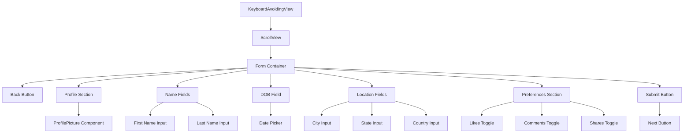
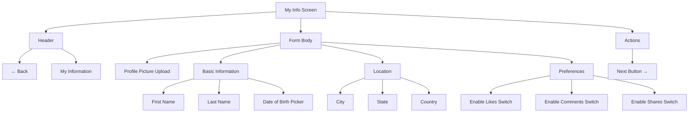
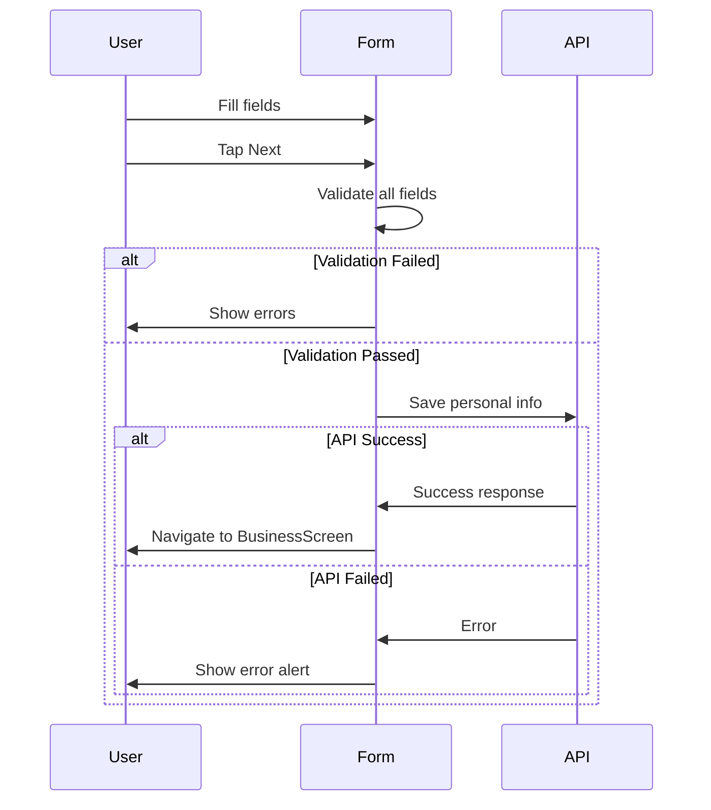

# My Info Screen

**Path:** `app/(tabs)/(settings)/MyInfoScreen.tsx`
**Route:** `/(tabs)/(settings)/MyInfoScreen`
**Status:** Active
**Parent Layout:** Settings Tab Stack Navigator

## Overview

The My Info Screen is a comprehensive form for collecting personal information and preferences. It includes fields for name, date of birth, location, and user preferences (likes, comments, shares). Features validation, profile picture upload, and navigates to Business Screen upon completion.

## Component Hierarchy



## UI Layout



## Fields & Validation

| Field | Type | Validation | Error Message |
|-------|------|------------|---------------|
| Profile Picture | Image | Optional | - |
| First Name | TextInput | Required, not empty | "First name is required" |
| Last Name | TextInput | Required, not empty | "Last name is required" |
| Date of Birth | DatePicker | Required, Millennials 1981-1997 | "Must be Millennial (1981-1997)" |
| City | TextInput | Optional | - |
| State | TextInput | Optional | - |
| Country | TextInput | Optional | - |
| Likes | Switch | Boolean (default: true) | - |
| Comments | Switch | Boolean (default: true) | - |
| Shares | Switch | Boolean (default: true) | - |

## State Management

```typescript
// Form fields
- firstName: string
- lastName: string
- dateOfBirth: Date
- city: string
- state: string
- country: string
- likesEnabled: boolean
- commentsEnabled: boolean
- sharesEnabled: boolean

// UI state
- loading: boolean
- errors: Record<string, string>
- showDatePicker: boolean
```

## User Interactions

| Element | Action | Target |
|---------|--------|--------|
| Profile Picture | Tap | Image picker modal |
| Date Picker | Tap | Open native date picker |
| Switches | Toggle | Update boolean state |
| Next Button | Submit | Validate → Navigate to BusinessScreen |

## Form Submission Flow



## Visual Design

- **Profile Section**: Centered profile picture at top
- **Form Groups**: Sections separated visually
- **Input Styling**: Consistent with globalStyles
- **Switches**: iOS/Android native switches with labels
- **Colors**: Theme-aware (dark/light mode)

## Implementation Notes

**File Reference**: [app/(tabs)/(settings)/MyInfoScreen.tsx](../../../app/(tabs)/(settings)/MyInfoScreen.tsx)

**Key Dependencies**:
- ProfilePicture component
- DateTimePicker
- userProfileService.updatePersonalInfo()
- useUserProfile hook

**Data Persistence**: Saves to MongoDB via userProfileService

**Navigation**: `router.push("/(tabs)/(settings)/BusinessScreen")` on success

## Related Screens

- **Previous**: [Settings Hub](./settings-hub.md)
- **Next**: [Business Screen](./business-screen.md)

---

*Wireframe as of 2026-01-30*
