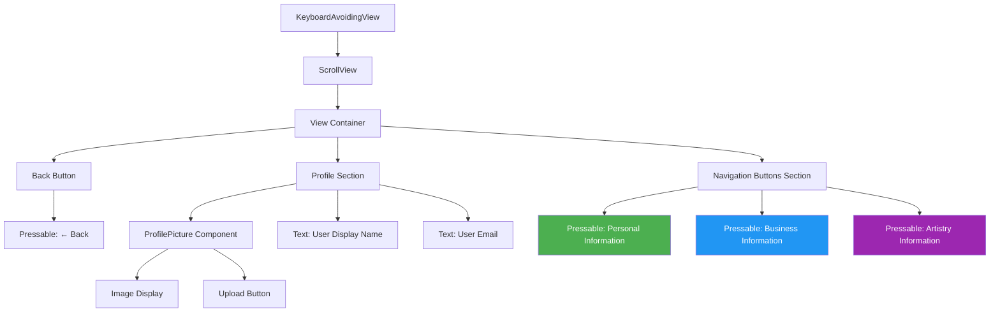
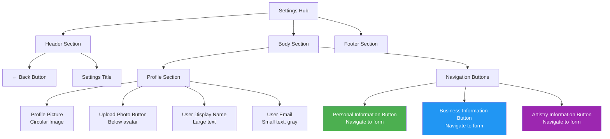
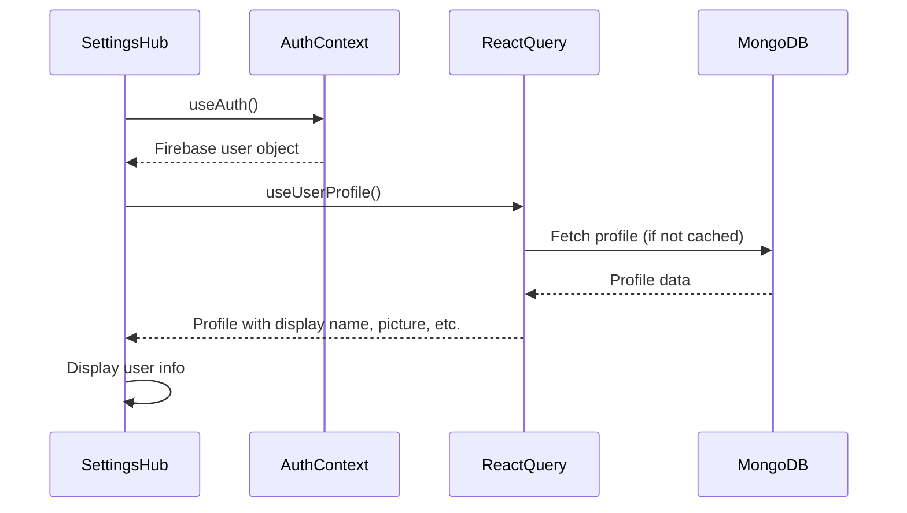
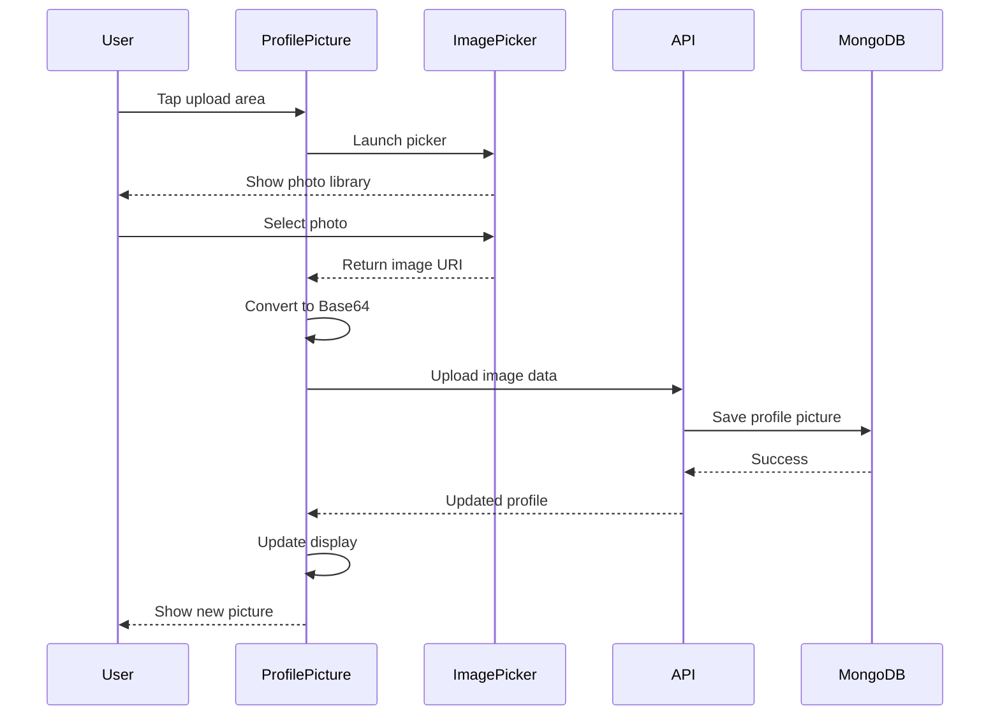
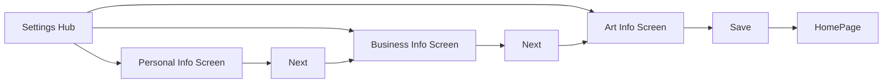

# Settings Hub

**Path:** `app/(tabs)/(settings)/Settings.tsx`
**Route:** `/(tabs)/(settings)/Settings`
**Status:** Active
**Parent Layout:** Settings Tab Stack Navigator (nested in Tabs Navigator)

## Overview

The Settings Hub serves as the central navigation point for user profile management. It displays the user's profile picture with upload functionality, user display information, and provides navigation to three detailed settings screens (Personal Info, Business Info, Art Info).

## Component Hierarchy



## UI Layout



## Components Used

**React Native Core:**
- `KeyboardAvoidingView` - Layout adjustment
- `ScrollView` - Scrollable content
- `View` - Container components
- `Text` - User info display
- `Pressable` (x4) - Back button, 3 navigation buttons
- `Platform` - Platform-specific behavior
- `useColorScheme` - Theme detection

**Custom Components:**
- **ProfilePicture** (`/components/ProfilePicture`) - Profile image with upload

**Expo Router:**
- `useRouter` - Imperative navigation to sub-screens

**Hooks:**
- **useAuth** - Access user data from auth context
- **useUserProfile** - Fetch user profile from MongoDB

**Styling:**
- `globalStyles` - Global style constants
- `COLORS` - Theme colors

## Key Features

1. **Profile Picture Display**: Shows user's profile photo
2. **Profile Picture Upload**: Upload/change profile photo
3. **User Information Display**:
   - Display name (from profile or Firebase)
   - Email address
4. **Navigation Hub**: Three buttons leading to detailed forms:
   - Personal Information
   - Business Information
   - Artistry Information
5. **Theme Support**: Dark/light mode compatible
6. **Back Navigation**: Return to previous screen

## User Interactions

| Element | Action | Navigation Target | Method |
|---------|--------|-------------------|--------|
| Back Button | onPress → router.back() | Previous screen | Imperative |
| Profile Picture | Tap upload area | Image picker | ProfilePicture component |
| Personal Info Button | onPress | `/(tabs)/(settings)/MyInfoScreen` | router.push() |
| Business Info Button | onPress | `/(tabs)/(settings)/BusinessScreen` | router.push() |
| Artistry Info Button | onPress | `/(tabs)/(settings)/ArtScreen` | router.push() |

## State Management

**Global State:**
```typescript
const { user } = useAuth();           // Firebase user object
const { profile } = useUserProfile(); // MongoDB user profile
```

**Derived Display Data:**
```typescript
- displayName: profile?.displayName || user?.displayName || 'User'
- email: user?.email || 'No email'
- profilePictureUrl: profile?.profilePicture || null
```

**No Local State** - All data comes from global context and React Query cache

## Data Flow



## Profile Picture Component

### Features
- **Display Mode**: Shows current profile picture or default avatar
- **Upload Mode**: Tap to select new photo
- **Image Picker Integration**: Uses `expo-image-picker`
- **Upload to Server**: Uploads to MongoDB via API

### Upload Flow



## Navigation Buttons

### Personal Information Button

**Appearance**:
- Primary green color
- Icon: Person or profile icon (optional)
- Label: "Personal Information"

**Action**: Navigate to MyInfoScreen
```typescript
router.push("/(tabs)/(settings)/MyInfoScreen");
```

### Business Information Button

**Appearance**:
- Secondary blue color
- Icon: Briefcase or business icon (optional)
- Label: "Business Information"

**Action**: Navigate to BusinessScreen
```typescript
router.push("/(tabs)/(settings)/BusinessScreen");
```

### Artistry Information Button

**Appearance**:
- Tertiary purple color
- Icon: Palette or art icon (optional)
- Label: "Artistry Information"

**Action**: Navigate to ArtScreen
```typescript
router.push("/(tabs)/(settings)/ArtScreen");
```

## Visual Design

### Layout Structure
```
┌─────────────────────────┐
│    ← Back    Settings   │ Header
├─────────────────────────┤
│                         │
│      ┌─────────┐        │
│      │ Profile │        │ Profile Picture
│      │  Image  │        │ (Circular, 120x120)
│      └─────────┘        │
│    [Upload Photo]       │ Upload button
│                         │
│   John Doe              │ Display Name (Large)
│   john@example.com      │ Email (Small, gray)
│                         │
├─────────────────────────┤
│ Personal Information    │ Button 1 (Green)
├─────────────────────────┤
│ Business Information    │ Button 2 (Blue)
├─────────────────────────┤
│ Artistry Information    │ Button 3 (Purple)
└─────────────────────────┘
```

### Typography
- **Title**: "Settings" - Large, bold
- **Display Name**: Large, bold
- **Email**: Small, regular, gray/muted color
- **Button Labels**: Medium, semi-bold

### Colors (Theme-aware)
- **Background**: `colors.background`
- **Text**: `colors.text`
- **Personal Button**: Primary color (green) - `colors.priC`
- **Business Button**: Secondary color (blue) - `colors.secC`
- **Art Button**: Tertiary color (purple) - `colors.triC`
- **Email Text**: Muted/gray - `colors.text` with opacity

### Spacing
- **Profile Section**: Centered, generous top padding
- **Button Spacing**: Consistent gaps between buttons
- **Section Padding**: Overall padding around content

## Profile Picture Specifications

### Image Display
- **Shape**: Circular (borderRadius: 50%)
- **Size**: 120x120 pixels (or responsive)
- **Border**: Optional border in theme color
- **Default**: Generic avatar icon or initials

### Upload Button
- **Position**: Below profile picture
- **Style**: Text button or small icon button
- **Label**: "Upload Photo" or camera icon
- **Action**: Opens image picker

### Image Requirements
- **Format**: JPEG, PNG
- **Max Size**: 5MB (recommended)
- **Aspect Ratio**: 1:1 (square, cropped if needed)
- **Resolution**: At least 200x200 for quality

## Screen States

### Default State
- Profile picture loaded (or default avatar)
- User name and email displayed
- All three navigation buttons visible and enabled

### Loading State (Profile Picture Upload)
- ActivityIndicator over profile picture
- Upload button disabled
- Navigation buttons still accessible

### Error State (Upload Failed)
- Alert/toast message: "Failed to upload photo"
- Original picture remains
- Retry option available

## Accessibility

**Current Implementation:**
- Pressable buttons with touch feedback
- Clear button labels

**Potential Improvements:**
- `accessibilityLabel` for profile picture ("Profile picture. Tap to upload new photo.")
- `accessibilityHint` for navigation buttons ("Opens personal information form")
- Screen reader support for user info
- Focus order for keyboard navigation

## Implementation Notes

### File Reference
[app/(tabs)/(settings)/Settings.tsx](../../../app/(tabs)/(settings)/Settings.tsx)

### Key Dependencies
- ProfilePicture component
- useAuth hook
- useUserProfile hook
- expo-image-picker (via ProfilePicture)
- userProfileService (for API calls)

### Data Sources
```typescript
// Firebase user (auth state)
const { user } = useAuth();

// MongoDB profile (user data)
const { profile, isLoading, refetch } = useUserProfile();

// Display values
const displayName = profile?.displayName || user?.displayName || 'User';
const email = user?.email || '';
const profilePicUrl = profile?.profilePicture || null;
```

## Related Screens

**Previous Screens:**
- Any screen in the app (Settings tab accessible from tab bar)

**Next Screens:**
- [My Info Screen](./my-info-screen.md) - Personal information form
- [Business Screen](./business-screen.md) - Business questionnaire
- [Art Screen](./art-screen.md) - Artist questionnaire

**Parent Layout:**
- Settings Tab Stack Layout (`app/(tabs)/(settings)/_layout.tsx`)

## Settings Workflow

The Settings Hub is the entry point for a multi-step workflow:



**User Journey**:
1. User taps Settings tab
2. Arrives at Settings Hub
3. Can navigate to any of the three forms
4. Forms can be completed in sequence (Personal → Business → Art → Home)
5. Or individually at any time

## Future Enhancements

### Planned Features
1. **Additional Settings**:
   - Notification preferences
   - Privacy settings
   - Account security
   - App preferences (language, theme)

2. **Profile Picture Enhancements**:
   - In-app camera capture
   - Photo cropping tool
   - Filters/effects
   - Avatar selection

3. **User Stats**:
   - Profile completion percentage
   - Account creation date
   - Usage statistics

4. **Quick Actions**:
   - Change password
   - Update email
   - Delete account

### Analytics
- Track which settings screens users visit most
- Monitor profile picture upload success rate
- Measure settings completion rate

---

*This wireframe documents the current implementation as of 2026-01-30.*
