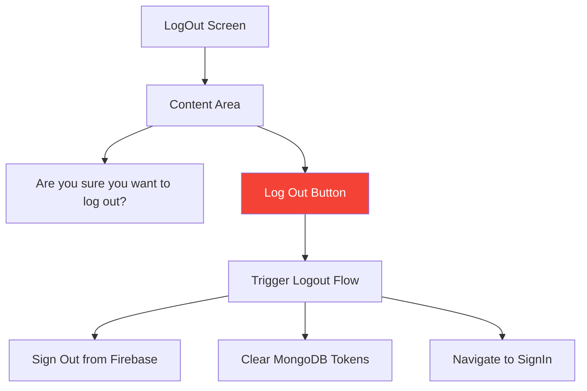
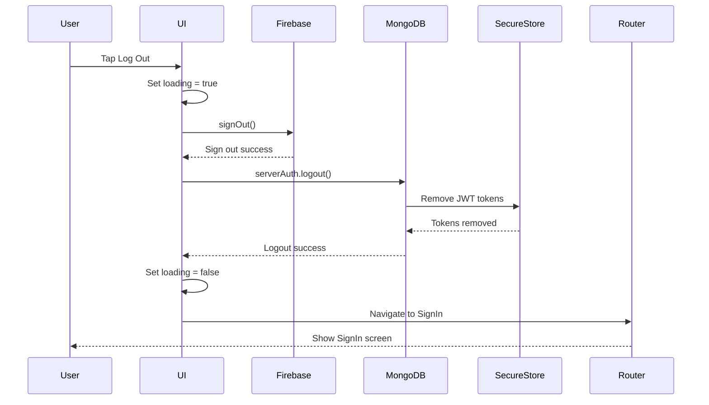
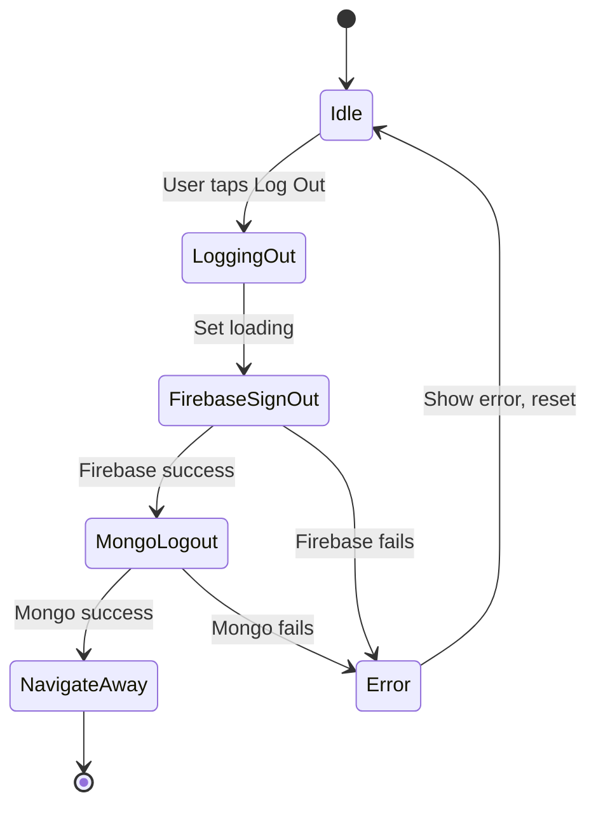

# LogOut Screen

**Path:** `app/(tabs)/LogOutScreen.tsx`
**Route:** `/(tabs)/LogOutScreen`
**Status:** Active
**Parent Layout:** Tabs Navigator (Direct Tab)

## Overview

The LogOut Screen provides a simple logout button that handles dual authentication cleanup (Firebase + MongoDB), clears secure tokens, and navigates users back to the sign-in screen. It's accessible as a dedicated tab in the main navigation.

## Component Hierarchy

```mermaid
graph TD
    A[View Container] --> B[Title Section]
    A --> C[Logout Button]

    B --> B1[Text: Confirm Logout]

    C --> C1[Pressable: Log Out Button]
    C1 --> C1a[Loading: ActivityIndicator]
    C1 --> C1b[Default: Text "Log Out"]
```

## UI Layout



## Components Used

**React Native Core:**
- `View` - Container
- `Text` - Title and button label
- `Pressable` - Logout button
- `Alert` - Confirmation/error messages
- `ActivityIndicator` - Loading state
- `useColorScheme` - Theme detection

**Expo Router:**
- `useRouter` - Navigation after logout

**Authentication:**
- `auth().signOut()` - Firebase logout
- `serverAuth.logout()` - MongoDB token cleanup

**Custom Hooks:**
- `useAuth` - Access auth context

## Key Features

1. **Dual Logout**: Clears both Firebase and MongoDB sessions
2. **Token Cleanup**: Removes JWT tokens from SecureStore
3. **Auto Navigation**: Redirects to sign-in screen after logout
4. **Loading State**: Shows indicator during logout process
5. **Error Handling**: Displays errors if logout fails
6. **Confirmation**: Optional confirmation dialog (future enhancement)

## User Interactions

| Element | Action | Result |
|---------|--------|--------|
| Log Out Button | onPress → handleLogout() | Trigger logout flow |

## Logout Flow



## State Management

```typescript
// Local state
- loading: boolean    // Logout in progress

// Global state (auto-updated by AuthProvider)
- user: null (after logout)
```

## Logout Implementation

```typescript
const handleLogout = async () => {
  try {
    setLoading(true);

    // Step 1: Sign out from Firebase
    await auth().signOut();

    // Step 2: Clear MongoDB tokens
    await serverAuth.logout();

    // Step 3: Navigate to sign in
    router.replace("/(auth)/SignInScreen");
  } catch (error) {
    console.error("Logout error:", error);
    Alert.alert("Error", "Failed to log out. Please try again.");
  } finally {
    setLoading(false);
  }
};
```

## Visual Design

### Layout
```
┌─────────────────────────┐
│                         │
│                         │
│   Are you sure you      │
│   want to log out?      │
│                         │
│   ┌─────────────────┐   │
│   │    Log Out      │   │ Red button
│   └─────────────────┘   │
│                         │
│                         │
└─────────────────────────┘
```

### Typography
- **Title**: Medium, centered
- **Button Label**: Bold, white text

### Colors (Theme-aware)
- **Background**: `colors.background`
- **Title Text**: `colors.text`
- **Logout Button**: Red/danger color (#f44336)
- **Button Text**: White

### Loading State
- Button shows `<ActivityIndicator color="white" />`
- Button label hidden
- Button disabled

## Screen States

### 1. Default State


### 2. Loading State
- **UI**: ActivityIndicator in button
- **Button**: Disabled
- **Duration**: 1-3 seconds typically

### 3. Error State
- **Alert**: "Failed to log out. Please try again."
- **Button**: Re-enabled
- **User Action**: Can retry

## Security Considerations

1. **Complete Session Cleanup**:
   - Firebase auth state cleared
   - MongoDB JWT tokens removed from SecureStore
   - User object set to null in AuthContext

2. **Token Removal**:
   ```typescript
   // Removes from secure storage
   await SecureStore.deleteItemAsync('accessToken');
   await SecureStore.deleteItemAsync('refreshToken');
   ```

3. **Navigation**:
   - Uses `replace` to prevent back button to authenticated screens
   - Auth gating in root layout ensures protection

4. **No Partial Logout**:
   - If Firebase succeeds but MongoDB fails, user still logged out
   - Warning shown but user redirected (fail-safe)

## Error Handling

### Firebase Logout Errors
- Rare, usually network-related
- User still redirected to sign-in (fail-safe)

### MongoDB Logout Errors
- Token cleanup may fail if network issues
- Not critical - tokens expire naturally
- User still signed out from Firebase

### Network Errors
- Show alert: "Check your connection and try again"
- Keep user on logout screen
- Allow retry

## Implementation Notes

**File Reference**: [app/(tabs)/LogOutScreen.tsx](../../../app/(tabs)/LogOutScreen.tsx)

**Key Dependencies**:
- `@react-native-firebase/auth`
- `serverAuth` service
- `expo-secure-store` (via serverAuth)

**Auth State Update**:
- Firebase `signOut()` triggers `onAuthStateChanged` in AuthProvider
- AuthProvider sets `user = null`
- Root layout detects null user → redirects to auth screens

## Related Screens

**Previous Screens:**
- Any authenticated screen (accessed via tab)

**Next Screen:**
- [Sign In Screen](../01-authentication/signin-screen.md) - After logout

**Navigation Context:**
- Logout tab always visible in authenticated tabs
- Instant access from anywhere in app

## Future Enhancements

### Potential Features
1. **Confirmation Dialog**:
   ```typescript
   Alert.alert(
     "Log Out",
     "Are you sure you want to log out?",
     [
       { text: "Cancel", style: "cancel" },
       { text: "Log Out", onPress: handleLogout, style: "destructive" }
     ]
   );
   ```

2. **Sign Out of All Devices**:
   - Backend endpoint to invalidate all user tokens
   - Option in logout screen

3. **Remember Me**:
   - Option to stay logged in
   - Extended token expiration

4. **Logout Analytics**:
   - Track logout frequency
   - Session duration before logout

## Tab Bar Configuration

**Tab Icon**: Exit/logout icon (e.g., `log-out-outline`)

**Tab Label**: "LogOut"

**Tab Order**: Last tab (rightmost position)

**Always Visible**: Yes (no `href: null`)

---

*Wireframe as of 2026-01-30*
