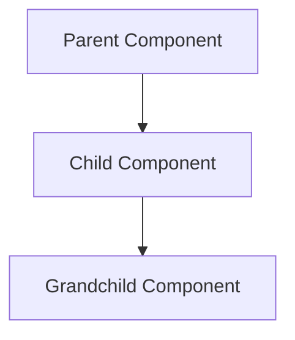
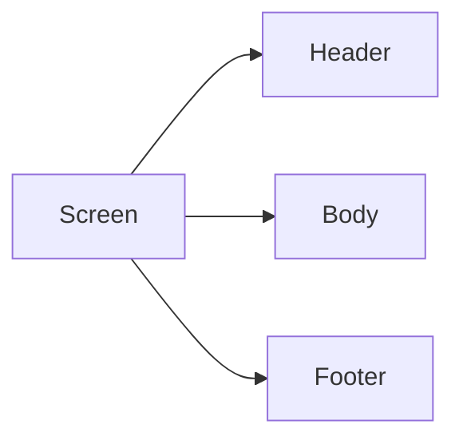

# Wireframes

Screen-by-screen wireframes with Mermaid diagrams documenting the current implementation of MillennialsPrimeAPP.

## Wireframe Structure

Each wireframe includes:
- **Component Hierarchy Diagram**: Visual tree of React components
- **UI Layout Diagram**: Screen sections and layout structure
- **Components Used**: List of imported components
- **User Interactions Table**: Actions and navigation targets
- **State Management**: Local and global state
- **Validation Rules**: Form validation (if applicable)

## Authentication Screens (4 screens) ✅

**Status**: Active in production

- [Welcome Screen](./01-authentication/welcome-screen.md) - App entry point with login/signup options
- [Sign In Screen](./01-authentication/signin-screen.md) - Email/password login with dual auth
- [Register Screen](./01-authentication/register-screen.md) - User registration with Millennials validation
- [Password Recovery Screen](./01-authentication/password-recovery-screen.md) - Firebase password reset

## Home Tab (1 screen) ✅

**Status**: Active in production

- [HomePage](./02-home-tab/home-page.md) - Video content feed with Bunny CDN, HBO-style carousels

## Settings Tab (4 screens) ✅

**Status**: Active in production

- [Settings Hub](./03-settings-tab/settings-hub.md) - Central navigation for profile management
- [My Info Screen](./03-settings-tab/my-info-screen.md) - Personal information form
- [Business Screen](./03-settings-tab/business-screen.md) - Business questionnaire with conditional fields
- [Art Screen](./03-settings-tab/art-screen.md) - Artist questionnaire with 14+ conditional fields

## Hidden Features (8 screens) ⏳

**Status**: Implemented but disabled (`href: null`)

### Social Tab (5 screens)
*Documented in [Future Features Flow](../user-journeys/future-features-flow.md)*
- Social Feed Index - Navigation hub
- Connected Users Screen - User list with badges
- My Profile Screen - User's posts feed
- E-Commerce Screen - Marketplace with bottom sheet
- User Profile [id] - Dynamic user profiles

### Upload Tab (1 screen)
- Upload Content Screen - File upload interface

### Shows Tab (2 screens)
- Prime Show - WebView streaming
- Show View Screen - Episodes listing

## Other Screens (1 screen) ✅

**Status**: Active in production

- [LogOut Screen](./07-other/logout-screen.md) - Dual authentication cleanup

## Wireframe Legend

### Component Hierarchy Diagrams

### UI Layout Diagrams

### Status Indicators
- ✅ **Complete** - Wireframe fully documented
- ⏳ **Pending** - Wireframe to be created
- 🔒 **Hidden** - Feature implemented but disabled

## Usage

### For Business Review
1. Compare wireframes to design mockups
2. Verify user flows match expectations
3. Identify gaps or misalignments
4. Plan design updates

### For Development
1. Reference component structure
2. Understand state management patterns
3. Review validation rules
4. Check navigation patterns

## Mermaid Diagrams

All diagrams use Mermaid syntax. View in:
- GitHub (automatic rendering)
- VSCode (with Mermaid extension)
- Mermaid Live Editor: https://mermaid.live

---

*Wireframes documented as of 2026-01-30*
